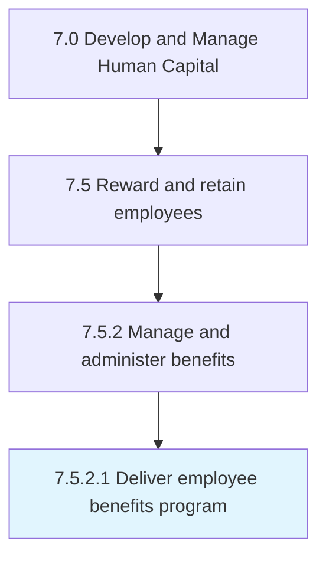

# Deliver employee benefits program

> Implementing the programs that specify employee benefits, other than salary provided, such as those concerning medical care, death, and disability.

## Overview

Activity 7.5.2.1 is an activity within the Develop and Manage Human Capital framework. 

Implementing the programs that specify employee benefits, other than salary provided, such as those concerning medical care, death, and disability.

## Process Hierarchy



## Key Statistics

| Metric | Value |
|--------|-------|
| APQC Code | 10504 |
| Hierarchy ID | 7.5.2.1 |
| Level | Activity |
| Parent | [7.5.2](../) |
| Sub-Processes | 0 |


## GraphDL Semantic Structure

```
deliver.EmployeeBenefitsProgram
```

| Component | Value | Description |
|-----------|-------|-------------|
| Verb | `deliver` | Primary action |
| Object | `employee benefits program` | Direct object |


## Related Concepts

- [EmployeeBenefitsProgram](/concepts/EmployeeBenefitsProgram)


---

*Source: APQC PCF 10504 (7.5.2.1) - APQC*
