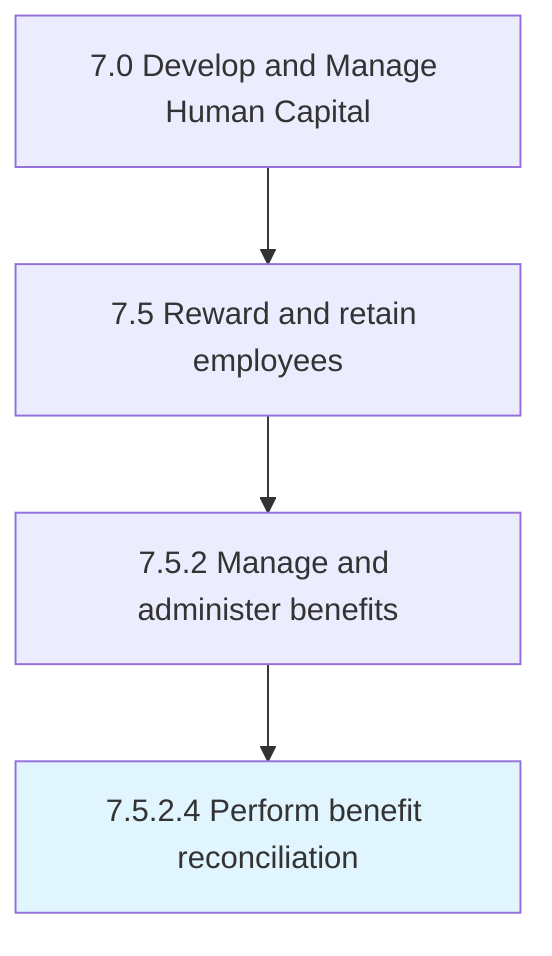

# Perform benefit reconciliation

> Carrying out reconciliation of benefits delivered to employees.

## Overview

Activity 7.5.2.4 is an activity within the Develop and Manage Human Capital framework. 

Carrying out reconciliation of benefits delivered to employees. Compare the estimated benefit requirement made by the employee and the actual amount of benefits the employee is entitled to receive.

## Process Hierarchy



## Key Statistics

| Metric | Value |
|--------|-------|
| APQC Code | 10507 |
| Hierarchy ID | 7.5.2.4 |
| Level | Activity |
| Parent | [7.5.2](../) |
| Sub-Processes | 0 |


## GraphDL Semantic Structure

```
perform.BenefitReconciliation
```

| Component | Value | Description |
|-----------|-------|-------------|
| Verb | `perform` | Primary action |
| Object | `benefit reconciliation` | Direct object |


## Related Concepts

- [BenefitReconciliation](/concepts/BenefitReconciliation)


---

*Source: APQC PCF 10507 (7.5.2.4) - APQC*
