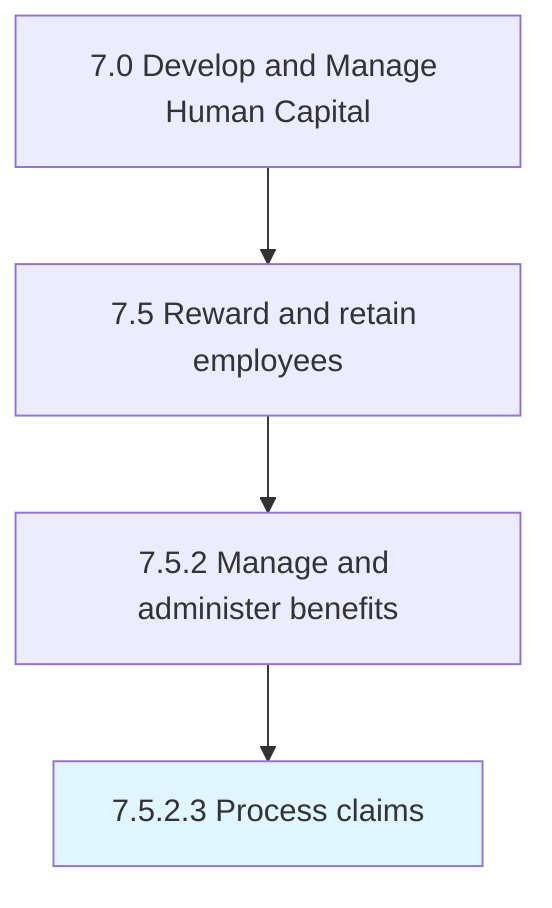

# Process claims

> Processing any formal requests or demands made by the employees claiming that they have earned some benefits.

## Overview

Activity 7.5.2.3 is an activity within the Develop and Manage Human Capital framework. 

Processing any formal requests or demands made by the employees claiming that they have earned some benefits. Send the request further up the managerial hierarchy to ensure approval.

## Process Hierarchy



## Key Statistics

| Metric | Value |
|--------|-------|
| APQC Code | 10506 |
| Hierarchy ID | 7.5.2.3 |
| Level | Activity |
| Parent | [7.5.2](../) |
| Sub-Processes | 0 |


## GraphDL Semantic Structure

```
process.Claims
```

| Component | Value | Description |
|-----------|-------|-------------|
| Verb | `process` | Primary action |
| Object | `claims` | Direct object |


## Related Concepts

- [Claims](/concepts/Claims)


---

*Source: APQC PCF 10506 (7.5.2.3) - APQC*
