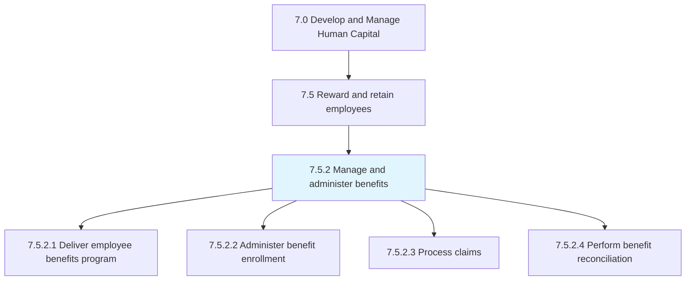
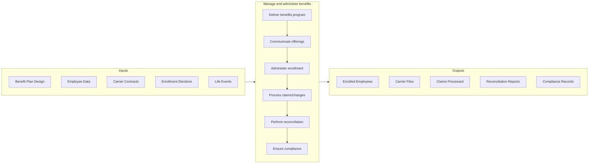

# Manage and administer benefits

> Managing and ensuring benefits enrollment by the employees.

## Overview

Process 7.5.2 is a core process within [Reward and Retain Employees](../) that delivers and administers the full range of employee benefits programs. This process encompasses health insurance, retirement plans, life insurance, disability coverage, paid time off, and other benefits that form a critical part of total compensation.

Benefits administration requires balancing employee needs, cost management, regulatory compliance, and competitive positioning. Effective administration delivers a positive employee experience through clear communication, easy enrollment, responsive service, and accurate processing while controlling costs and ensuring compliance with ERISA, ACA, COBRA, HIPAA, and other regulations.

## Process Hierarchy



## Key Statistics

| Metric | Value |
|--------|-------|
| APQC Code | 10495 |
| Hierarchy ID | 7.5.2 |
| Level | Process |
| Parent | [7.5](../) |
| Sub-Processes | 4 |

## GraphDL Semantic Structure

```graphdl
administer.Benefits.for.Employees
```

| Component | Value | Description |
|-----------|-------|-------------|
| Verb | `administer` | Primary action of managing delivery |
| Object | `Benefits` | Compensation beyond salary |
| Preposition | `for` | Beneficiary relationship |
| PrepObject | `Employees` | Workforce members |

## Process Flow



## Sub-Processes

| Process | Hierarchy ID | Description |
|---------|-------------|-------------|
| [Deliver employee benefits program](./DeliverEmployeeBenefitsProgram) | 7.5.2.1 | Implementing and communicating benefit offerings |
| [Administer benefit enrollment](./AdministerBenefitEnrollment) | 7.5.2.2 | Managing open enrollment, new hire enrollment, and life events |
| [Process claims](./ProcessClaims) | 7.5.2.3 | Handling benefit claims, appeals, and issue resolution |
| [Perform benefit reconciliation](./PerformBenefitReconciliation) | 7.5.2.4 | Ensuring accuracy between HRIS, carriers, and payroll |

## RACI Matrix

| Activity | Responsible | Accountable | Consulted | Informed |
|----------|-------------|-------------|-----------|----------|
| Design benefit programs | Benefits Manager | VP Total Rewards | Finance, Legal | Employees |
| Select/manage vendors | Benefits Manager | VP Total Rewards | Procurement | HR |
| Communicate benefits | Benefits Team | Benefits Manager | Communications | Employees |
| Administer enrollment | Benefits Admin | Benefits Manager | HRIS | Payroll |
| Process claims/issues | Benefits Admin | Benefits Manager | Carriers | Employees |
| Ensure compliance | Benefits Manager | VP Total Rewards | Legal | Finance |

## Key Stakeholders

- **Benefits Team**: Designs, administers, and supports benefits programs
- **Employees**: Primary beneficiaries of programs
- **Carriers/Vendors**: Provide insurance and services
- **Finance**: Budgets and pays for benefits
- **Legal/Compliance**: Ensures regulatory adherence
- **Payroll**: Processes benefit deductions

## Metrics and KPIs

| Metric | Description | Target |
|--------|-------------|--------|
| Enrollment Accuracy | Error-free enrollment rate | >99% |
| On-Time Enrollment | Enrollments processed within SLA | >98% |
| Benefits Cost per Employee | Total benefits cost / headcount | Market competitive |
| Employee Satisfaction | Satisfaction with benefits | >80% |
| Carrier File Accuracy | Error-free carrier transmissions | >99.5% |
| Claims Resolution Time | Days to resolve benefit issues | <5 days |
| Open Enrollment Participation | Employees completing enrollment | >95% |
| Compliance Score | Audit findings | Zero critical |

## Related Departments

- [Human Resources](/departments/HumanResources) - Benefits ownership
- [Finance](/departments/Finance) - Cost management and payment
- [Legal](/departments/Legal) - Compliance oversight
- [Payroll](/departments/Finance/Payroll) - Deduction processing

## Related Occupations

- [Compensation and Benefits Managers](/occupations/Management/CompensationBenefitsManagers) - Program oversight
- [Human Resources Specialists](/occupations/Business/HumanResourcesSpecialists) - Benefits administration
- [Financial Analysts](/occupations/Business/FinancialAnalysts) - Cost analysis

## Related Concepts

- HealthInsurance
- RetirementPlans
- BenefitsEnrollment
- TotalRewards
- ERISACompliance
- VendorManagement
- EmployeeExperience

---

*Source: APQC PCF 10495 (7.5.2) - APQC*
