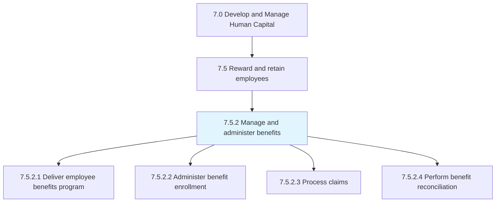
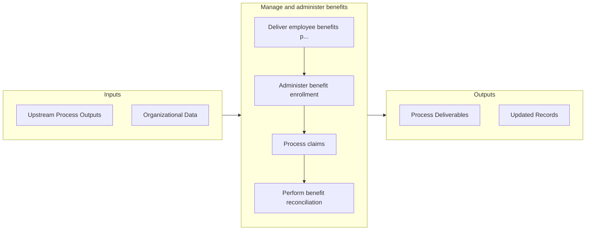

# Manage and administer benefits

> Managing and ensuring benefits enrollment by the employees.

## Overview

Process 7.5.2 is a core process that defines the specific procedures for manage and administer benefits. 

Managing and ensuring benefits enrollment by the employees. Process any benefit claims made by the employees. Balance the estimated amount and entitled amount of benefits.

## Process Hierarchy



## Key Statistics

| Metric | Value |
|--------|-------|
| APQC Code | 10495 |
| Hierarchy ID | 7.5.2 |
| Level | Process |
| Parent | [7.5](../) |
| Sub-Processes | 4 |


## GraphDL Semantic Structure

```graphdl
manage.AndAdministerBenefits
```

| Component | Value | Description |
|-----------|-------|-------------|
| Verb | `manage` | Primary action |
| Object | `and administer benefits` | Direct object |


## Process Flow



## Sub-Processes

| Process | Hierarchy ID | Description |
|---------|-------------|-------------|
| [Deliver employee benefits program](./DeliverEmployeeBenefitsProgram) | 7.5.2.1 | Implementing the programs that specify employee benefits, other than salary provided, such as those  |
| [Administer benefit enrollment](./AdministerBenefitEnrollment) | 7.5.2.2 | Handling the employee enrollment for obtaining benefits |
| [Process claims](./ProcessClaims) | 7.5.2.3 | Processing any formal requests or demands made by the employees claiming that they have earned some  |
| [Perform benefit reconciliation](./PerformBenefitReconciliation) | 7.5.2.4 | Carrying out reconciliation of benefits delivered to employees |


## Related Concepts

- Benefits
- Benefits


---

*Source: APQC PCF 10495 (7.5.2) - APQC*
