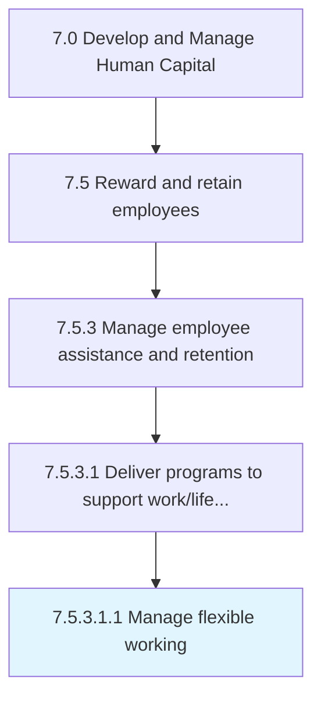

# Manage flexible working

> Creation and execution of a plan that might allow for work from home days, or alternate hours.

## Overview

Sub-Activity 7.5.3.1.1 is an activity within the Develop and Manage Human Capital framework. 

Creation and execution of a plan that might allow for work from home days, or alternate hours.

## Process Hierarchy



## Key Statistics

| Metric | Value |
|--------|-------|
| APQC Code | 21440 |
| Hierarchy ID | 7.5.3.1.1 |
| Level | Sub-Activity |
| Parent | [7.5.3.1](../) |
| Sub-Processes | 0 |


## GraphDL Semantic Structure

```
manage.FlexibleWorking
```

| Component | Value | Description |
|-----------|-------|-------------|
| Verb | `manage` | Primary action |
| Object | `flexible working` | Direct object |


## Related Concepts

- FlexibleWorking


---

*Source: APQC PCF 21440 (7.5.3.1.1) - APQC*
