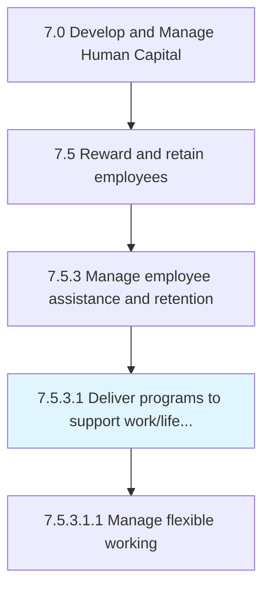
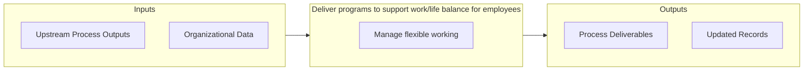

# Deliver programs to support work/life balance for employees

> Designing programs that prompt proper balance between work (i.

## Overview

Activity 7.5.3.1 is an activity within the Develop and Manage Human Capital framework. 

Designing programs that prompt proper balance between work (i.e., career and ambition) and lifestyle (i.e., health, pleasure, leisure, family, and spiritual development/meditation). Account for dependent care, flexible working arrangements, leaves of absence, on-the-job training, etc.

## Process Hierarchy



## Key Statistics

| Metric | Value |
|--------|-------|
| APQC Code | 10508 |
| Hierarchy ID | 7.5.3.1 |
| Level | Activity |
| Parent | [7.5.3](../) |
| Sub-Processes | 1 |


## GraphDL Semantic Structure

```graphdl
deliver.Programs.to.SupportWorklifeBalanceForEmployees
```

| Component | Value | Description |
|-----------|-------|-------------|
| Verb | `deliver` | Primary action |
| Object | `programs` | Direct object |
| Preposition | `to` | Relationship |
| PrepObject | `support work/life balance for employees` | Indirect object |


## Process Flow



## Sub-Processes

| Process | Hierarchy ID | Description |
|---------|-------------|-------------|
| [Manage flexible working](./ManageFlexibleWorking) | 7.5.3.1.1 | Creation and execution of a plan that might allow for work from home days, or alternate hours |


## Related Concepts

- Programs
- SupportWorkBalanceForEmployees
- Programs
- SupportLifeBalanceForEmployees


---

*Source: APQC PCF 10508 (7.5.3.1) - APQC*
