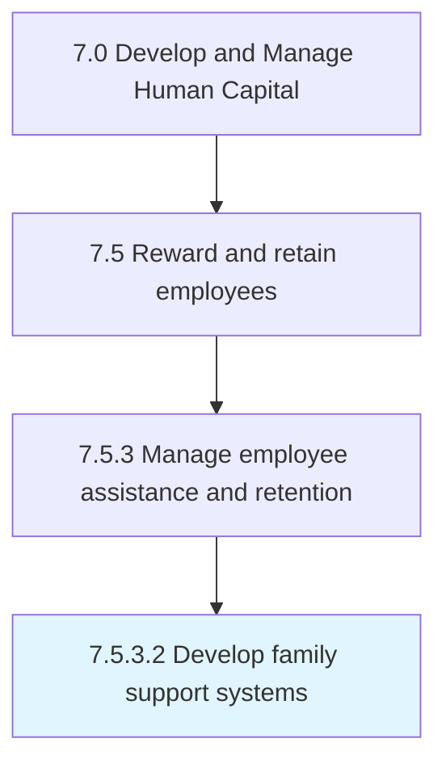

# Develop family support systems

> Creating a support structure that aligns with local and federal laws that allow for support for families.

## Overview

Activity 7.5.3.2 is an activity within the Develop and Manage Human Capital framework. 

Creating a support structure that aligns with local and federal laws that allow for support for families. This could include things like maternity leave, care for a family member, or in some cases, extended sick leave.

## Process Hierarchy



## Key Statistics

| Metric | Value |
|--------|-------|
| APQC Code | 10509 |
| Hierarchy ID | 7.5.3.2 |
| Level | Activity |
| Parent | [7.5.3](../) |
| Sub-Processes | 0 |


## GraphDL Semantic Structure

```
develop.FamilySupportSystems
```

| Component | Value | Description |
|-----------|-------|-------------|
| Verb | `develop` | Primary action |
| Object | `family support systems` | Direct object |


## Related Concepts

- [FamilySupportSystems](/concepts/FamilySupportSystems)


---

*Source: APQC PCF 10509 (7.5.3.2) - APQC*
