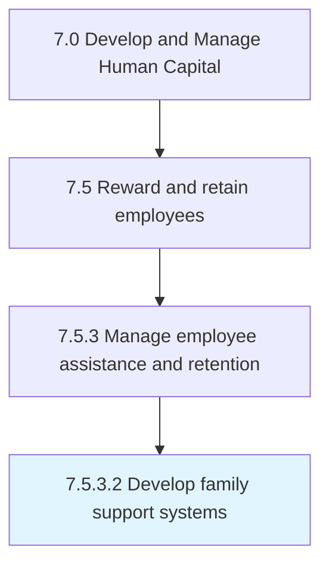
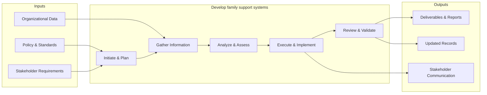
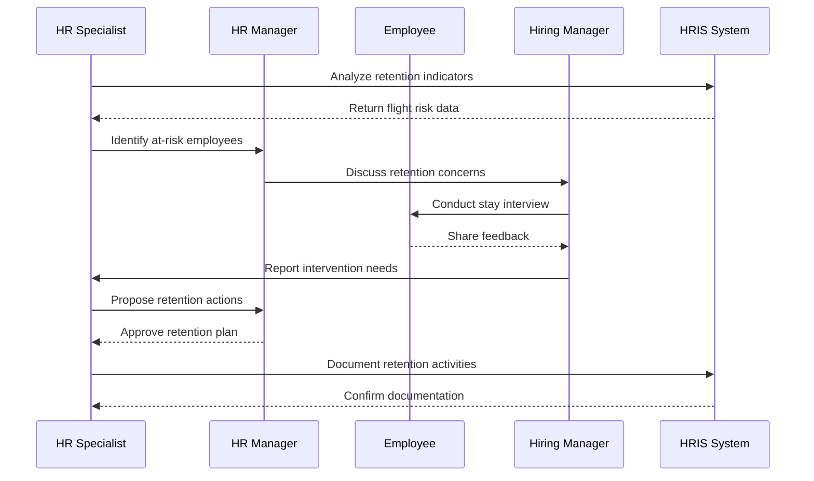

# Develop family support systems

> Creating a support structure that aligns with local and federal laws that allow for support for families.

## Overview

Activity 7.5.3.2 is an activity within the Develop and Manage Human Capital framework. 

Creating a support structure that aligns with local and federal laws that allow for support for families. This could include things like maternity leave, care for a family member, or in some cases, extended sick leave.

This process encompasses the end-to-end development of family support systems, from initial needs assessment through design, implementation, and evaluation. It requires cross-functional collaboration, alignment with organizational objectives, and iterative refinement based on stakeholder feedback and performance metrics.

## Process Hierarchy



## Key Statistics

| Metric | Value |
|--------|-------|
| APQC Code | 10509 |
| Hierarchy ID | 7.5.3.2 |
| Level | Activity |
| Parent | [7.5.3](../) |
| Sub-Processes | 0 |


## GraphDL Semantic Structure

```graphdl
develop.FamilySupportSystems
```

| Component | Value | Description |
|-----------|-------|-------------|
| Verb | `develop` | Primary action |
| Object | `family support systems` | Direct object |


## Related Concepts

- FamilySupportSystems


## Process Flow



## Process Sequence



## RACI Matrix

| Activity | Responsible | Accountable | Consulted | Informed |
|----------|------------|-------------|-----------|----------|
| Design compensation plan | Compensation Analyst | Compensation Manager | Finance | HR Director |
| Administer benefits | Benefits Specialist | Benefits Manager | Vendors | Employees |
| Process payroll | Payroll Specialist | Payroll Manager | Finance | Employees |

## Related Occupations

- [Compensation and Benefits Managers](/occupations/Management/CompensationAndBenefitsManagers)
- [Compensation, Benefits, and Job Analysis Specialists](/occupations/Business/CompensationBenefitsAndJobAnalysisSpecialists)
- [Human Resources Managers](/occupations/Management/HumanResourcesManagers)
- [Payroll and Timekeeping Clerks](/occupations/Administrative/PayrollAndTimekeepingClerks)
- [Financial Analysts](/occupations/Business/Financial/FinancialAnalysts)

## Related Departments

- Human Resources
- Finance
- Payroll

## Industry Variations

### Technology

Emphasizes stock options/RSUs, signing bonuses, flexible PTO policies, wellness stipends, and competitive total compensation benchmarking.

### Healthcare

Includes shift differentials, on-call pay, malpractice coverage, continuing education reimbursement, and loan forgiveness programs.

### Financial Services

Features performance-based bonuses, deferred compensation, profit sharing, comprehensive insurance packages, and regulatory-compliant incentive structures.

## KPIs & Metrics

| Metric | Description | Target |
|--------|-------------|--------|
| Total Compensation Competitiveness | Percentile ranking vs. market benchmarks | 50th-75th percentile |
| Benefits Utilization Rate | Percentage of employees actively using benefit programs | > 80% |
| Voluntary Turnover Rate | Annual voluntary employee departures as percentage of headcount | < 12% |
| Compensation Equity Ratio | Pay equity across demographic groups | 0.98-1.02 |

---

*Source: APQC PCF 10509 (7.5.3.2) - APQC*
