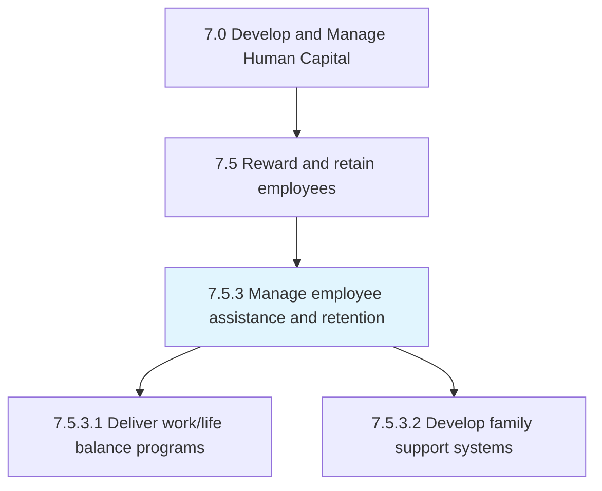
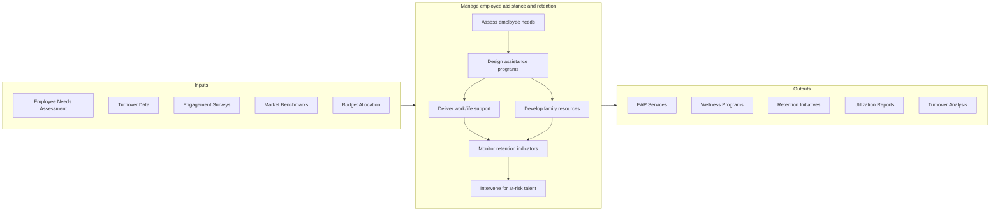

# Manage employee assistance and retention

> Managing activities centered around delivering programs to support work/life balance for employees; developing family support systems; reviewing retention and motivation indicators; and reviewing compensation plans.

## Overview

Process 7.5.3 is a core process within [Reward and Retain Employees](../) that focuses on supporting employee wellbeing and reducing unwanted turnover. This process addresses the holistic needs of employees beyond compensation, creating an environment where people can thrive professionally and personally.

Employee assistance and retention programs recognize that engaged, supported employees deliver better business outcomes. These programs include Employee Assistance Programs (EAP), wellness initiatives, work/life balance support, flexible work arrangements, family care resources, and proactive retention strategies for critical talent. Effective implementation requires understanding employee needs, measuring program effectiveness, and continuously evolving offerings.

## Process Hierarchy



## Key Statistics

| Metric | Value |
|--------|-------|
| APQC Code | 21439 |
| Hierarchy ID | 7.5.3 |
| Level | Process |
| Parent | [7.5](../) |
| Sub-Processes | 2 |

## GraphDL Semantic Structure

```graphdl
manage.EmployeeAssistance.for.Retention
```

| Component | Value | Description |
|-----------|-------|-------------|
| Verb | `manage` | Primary action of administering |
| Object | `EmployeeAssistance` | Support programs and services |
| Preposition | `for` | Purpose relationship |
| PrepObject | `Retention` | Keeping valuable employees |

## Process Flow



## Sub-Processes

| Process | Hierarchy ID | Description |
|---------|-------------|-------------|
| [Deliver programs to support work/life balance](./7.5.3.1-DeliverProgramsSupportWorklife/) | 7.5.3.1 | Designing and implementing programs for employee wellbeing and balance |
| [Develop family support systems](./DevelopFamilySupportSystems) | 7.5.3.2 | Creating resources for parental leave, childcare, eldercare, and family needs |

## RACI Matrix

| Activity | Responsible | Accountable | Consulted | Informed |
|----------|-------------|-------------|-----------|----------|
| Assess employee needs | HR Analytics | CHRO | Employees, Managers | Leadership |
| Design EAP programs | Benefits Team | VP Total Rewards | EAP Provider | Employees |
| Manage wellness initiatives | Wellness Coordinator | HR Director | Benefits, Safety | All Employees |
| Analyze retention risk | HR Analytics | HR Business Partner | Managers | Leadership |
| Conduct stay interviews | Managers | HR Business Partner | Employee | HR Analytics |
| Implement retention actions | Managers | Business Leader | HR, Finance | CHRO |

## Key Stakeholders

- **Benefits/Wellness Team**: Designs and administers assistance programs
- **HR Business Partners**: Identifies retention risks and interventions
- **Managers**: Supports employee wellbeing and retention
- **Employees**: Primary beneficiaries of programs
- **EAP Providers**: Delivers counseling and support services
- **Leadership**: Champions culture of wellbeing

## Metrics and KPIs

| Metric | Description | Target |
|--------|-------------|--------|
| Voluntary Turnover Rate | Annual voluntary departures | <12% |
| Regrettable Turnover | Loss of high performers/potentials | <5% |
| EAP Utilization Rate | Employees accessing EAP services | >8% |
| Program Satisfaction | Employee satisfaction with assistance programs | >80% |
| Retention of At-Risk | Employees retained after intervention | >75% |
| Work/Life Balance Score | Survey measure of balance | >4.0/5.0 |
| Wellness Participation | Employees in wellness programs | >50% |
| Return on Retention | Value of avoided turnover costs | >500% |

## Related Departments

- [Human Resources](/departments/HumanResources) - Program design and administration
- [Finance](/departments/Finance) - ROI analysis and budget
- [Legal](/departments/Legal) - Compliance with leave and benefits laws
- [All Departments](/departments) - Manager participation in retention

## Related Occupations

- [Human Resources Managers](/occupations/Management/HumanResourcesManagers) - Program oversight
- [Compensation and Benefits Managers](/occupations/Management/CompensationBenefitsManagers) - Benefits administration
- [Social Workers](/occupations/Community/SocialWorkers) - EAP services
- [Health Educators](/occupations/Education/HealthEducators) - Wellness programming

## Related Concepts

- EmployeeAssistanceProgram
- WorkLifeBalance
- TalentRetention
- EmployeeWellness
- EngagementStrategies
- FlexibleWork
- FamilyBenefits

---

*Source: APQC PCF 21439 (7.5.3) - APQC*
