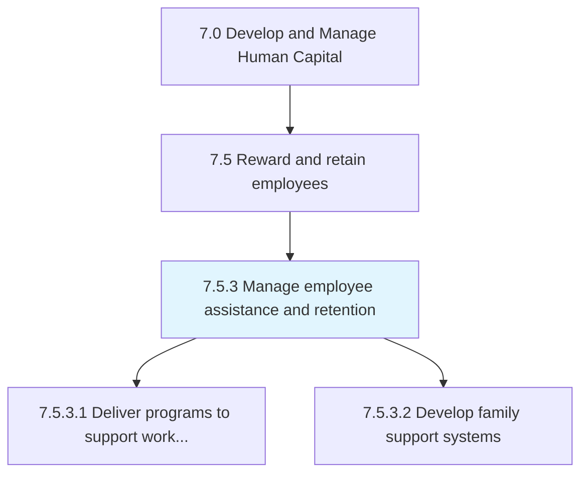
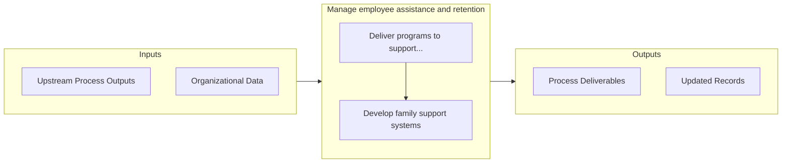

# Manage employee assistance and retention

> Managing activities centered around delivering programs to support work/life balance for employees; developing family support systems; reviewing retention and motivation indicators; and reviewing compensation plans.

## Overview

Process 7.5.3 is a core process that defines the specific procedures for manage employee assistance and retention. 

Managing activities centered around delivering programs to support work/life balance for employees; developing family support systems; reviewing retention and motivation indicators; and reviewing compensation plans.

## Process Hierarchy



## Key Statistics

| Metric | Value |
|--------|-------|
| APQC Code | 21439 |
| Hierarchy ID | 7.5.3 |
| Level | Process |
| Parent | [7.5](../) |
| Sub-Processes | 2 |


## GraphDL Semantic Structure

```
manage.EmployeeAssistanceAndRetention
```

| Component | Value | Description |
|-----------|-------|-------------|
| Verb | `manage` | Primary action |
| Object | `employee assistance and retention` | Direct object |


## Process Flow



## Sub-Processes

| Process | Hierarchy ID | Description |
|---------|-------------|-------------|
| [Deliver programs to support work/life balance for employees](./7.5.3.1-DeliverProgramsSupportWorklife/) | 7.5.3.1 | Designing programs that prompt proper balance between work (i |
| [Develop family support systems](./DevelopFamilySupportSystems) | 7.5.3.2 | Creating a support structure that aligns with local and federal laws that allow for support for fami |


## Related Concepts

- [EmployeeAssistance](/concepts/EmployeeAssistance)
- [Retention](/concepts/Retention)


---

*Source: APQC PCF 21439 (7.5.3) - APQC*
