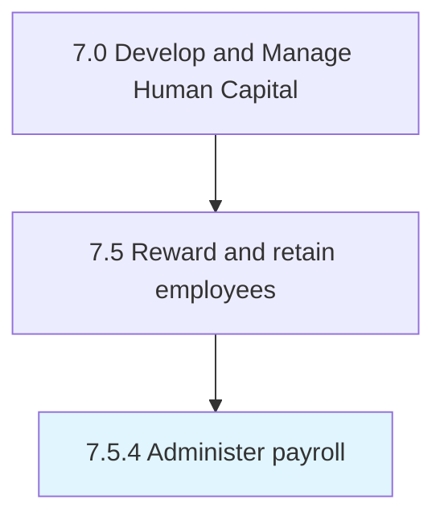

# Administer payroll

> Managing the sum of all financial records of salaries for an employee, including wages, bonuses, and deductions.

## Overview

Process 7.5.4 is a core process that defines the specific procedures for administer payroll. 

Managing the sum of all financial records of salaries for an employee, including wages, bonuses, and deductions. Use a payroll management system to deal with the financial aspects of employees' salaries, allowances, deductions, gross pay, net pay, etc. Generate pay slips for a specific period.

## Process Hierarchy



## Key Statistics

| Metric | Value |
|--------|-------|
| APQC Code | 10497 |
| Hierarchy ID | 7.5.4 |
| Level | Process |
| Parent | [7.5](../) |
| Sub-Processes | 0 |


## GraphDL Semantic Structure

```
administer.Payroll
```

| Component | Value | Description |
|-----------|-------|-------------|
| Verb | `administer` | Primary action |
| Object | `payroll` | Direct object |


## Related Concepts

- Payroll


---

*Source: APQC PCF 10497 (7.5.4) - APQC*
