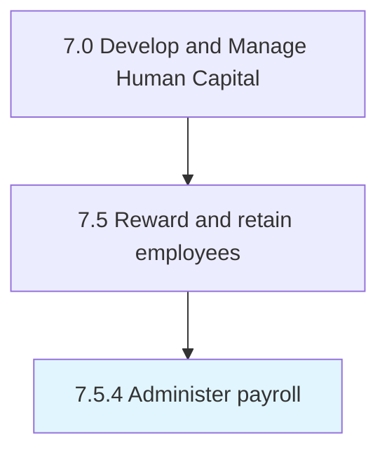
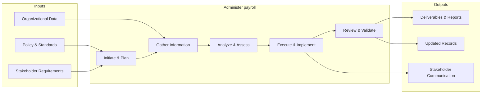

# Administer payroll

> Managing the sum of all financial records of salaries for an employee, including wages, bonuses, and deductions.

## Overview

Process 7.5.4 is a core process that defines the specific procedures for administer payroll. 

Managing the sum of all financial records of salaries for an employee, including wages, bonuses, and deductions. Use a payroll management system to deal with the financial aspects of employees' salaries, allowances, deductions, gross pay, net pay, etc. Generate pay slips for a specific period.

This process handles the administration of payroll across the organization. It includes processing transactions, maintaining records, ensuring policy compliance, managing exceptions, and providing support to stakeholders throughout the administrative lifecycle.

## Process Hierarchy



## Key Statistics

| Metric | Value |
|--------|-------|
| APQC Code | 10497 |
| Hierarchy ID | 7.5.4 |
| Level | Process |
| Parent | [7.5](../) |
| Sub-Processes | 0 |


## GraphDL Semantic Structure

```
administer.Payroll
```

| Component | Value | Description |
|-----------|-------|-------------|
| Verb | `administer` | Primary action |
| Object | `payroll` | Direct object |


## Related Concepts

- Payroll


## Process Flow



## RACI Matrix

| Activity | Responsible | Accountable | Consulted | Informed |
|----------|------------|-------------|-----------|----------|
| Design compensation plan | Compensation Analyst | Compensation Manager | Finance | HR Director |
| Administer benefits | Benefits Specialist | Benefits Manager | Vendors | Employees |
| Process payroll | Payroll Specialist | Payroll Manager | Finance | Employees |

## Related Occupations

- [Compensation and Benefits Managers](/occupations/CompensationAndBenefitsManagers)
- [Compensation, Benefits, and Job Analysis Specialists](/occupations/CompensationBenefitsAndJobAnalysisSpecialists)
- [Human Resources Managers](/occupations/HumanResourcesManagers)
- [Payroll and Timekeeping Clerks](/occupations/PayrollAndTimekeepingClerks)
- [Financial Analysts](/occupations/FinancialAnalysts)

## Related Departments

- Human Resources
- Finance
- Payroll

## Industry Variations

### Technology

Emphasizes stock options/RSUs, signing bonuses, flexible PTO policies, wellness stipends, and competitive total compensation benchmarking.

### Healthcare

Includes shift differentials, on-call pay, malpractice coverage, continuing education reimbursement, and loan forgiveness programs.

### Financial Services

Features performance-based bonuses, deferred compensation, profit sharing, comprehensive insurance packages, and regulatory-compliant incentive structures.

## KPIs & Metrics

| Metric | Description | Target |
|--------|-------------|--------|
| Total Compensation Competitiveness | Percentile ranking vs. market benchmarks | 50th-75th percentile |
| Benefits Utilization Rate | Percentage of employees actively using benefit programs | > 80% |
| Voluntary Turnover Rate | Annual voluntary employee departures as percentage of headcount | < 12% |
| Compensation Equity Ratio | Pay equity across demographic groups | 0.98-1.02 |

---

*Source: APQC PCF 10497 (7.5.4) - APQC*
