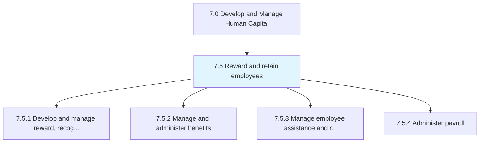
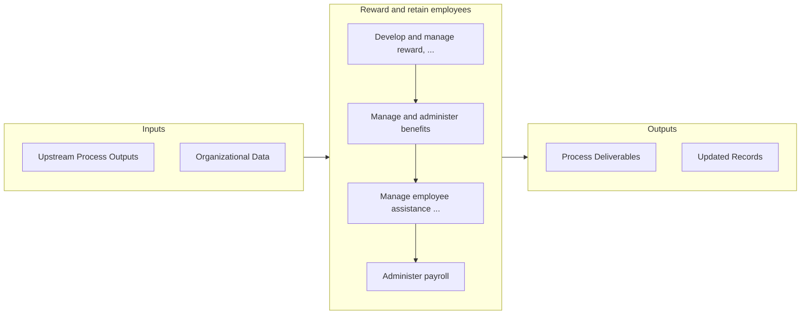

# Reward and retain employees

> Creating frameworks for rewarding and recognizing employees with the objective of retaining them.

## Overview

Group 7.5 is a process group within APQC Category 7.0 (Develop and Manage Human Capital). 

Creating frameworks for rewarding and recognizing employees with the objective of retaining them. Create and manage programs for provision of rewards, recognition, and motivation. Manage and administer the benefits for employees. Help assist and retain employees. Administer payroll to employees.

## Process Hierarchy



## Key Statistics

| Metric | Value |
|--------|-------|
| APQC Code | 10412 |
| Hierarchy ID | 7.5 |
| Level | Group |
| Parent | [7](../) |
| Sub-Processes | 4 |


## GraphDL Semantic Structure

```graphdl
reward.AndRetainEmployees
```

| Component | Value | Description |
|-----------|-------|-------------|
| Verb | `reward` | Primary action |
| Object | `and retain employees` | Direct object |


## Process Flow



## Sub-Processes

| Process | Hierarchy ID | Description |
|---------|-------------|-------------|
| [Develop and manage reward, recognition, and motivation programs](./7.5.1-DevelopManageRewardRecognition/) | 7.5.1 | Developing a salary/compensation structure and plan; developing a benefits and reward plan; develop  |
| [Manage and administer benefits](./7.5.2-ManageAdministerBenefits/) | 7.5.2 | Managing and ensuring benefits enrollment by the employees |
| [Manage employee assistance and retention](./7.5.3-ManageEmployeeAssistanceRetention/) | 7.5.3 | Managing activities centered around delivering programs to support work/life balance for employees;  |
| [Administer payroll](./AdministerPayroll) | 7.5.4 | Managing the sum of all financial records of salaries for an employee, including wages, bonuses, and |


## Related Concepts

- Employees
- Employees


---

*Source: APQC PCF 10412 (7.5) - APQC*
