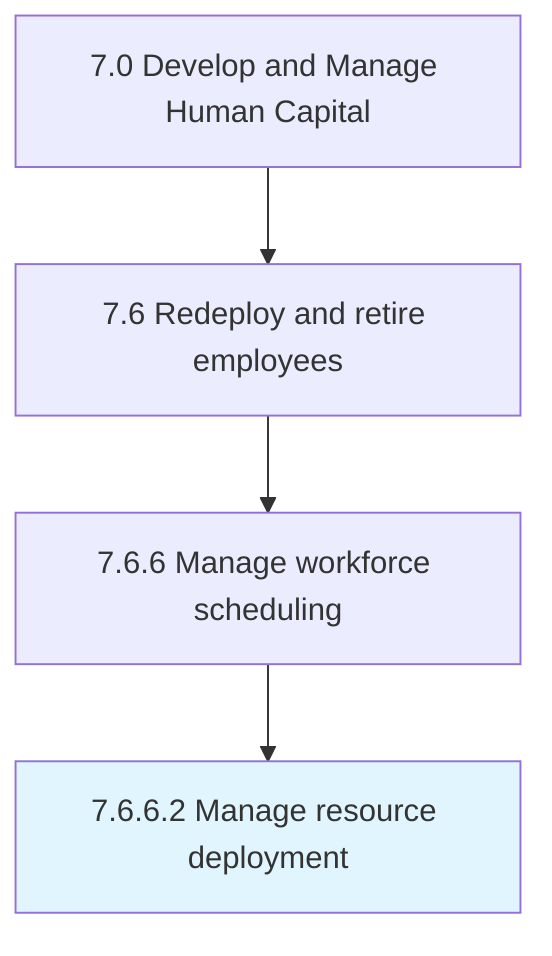

# Manage resource deployment

> Allocating employees.

## Overview

Activity 7.6.6.2 is an activity within the Develop and Manage Human Capital framework. 

Allocating employees. Deploy personnel to ensure that the labor of the organization is continuously in an optimal relation to the jobs and organizational structure.

## Process Hierarchy



## Key Statistics

| Metric | Value |
|--------|-------|
| APQC Code | 10517 |
| Hierarchy ID | 7.6.6.2 |
| Level | Activity |
| Parent | [7.6.6](../) |
| Sub-Processes | 0 |


## GraphDL Semantic Structure

```
manage.ResourceDeployment
```

| Component | Value | Description |
|-----------|-------|-------------|
| Verb | `manage` | Primary action |
| Object | `resource deployment` | Direct object |


## Related Concepts

- [ResourceDeployment](/concepts/ResourceDeployment)


---

*Source: APQC PCF 10517 (7.6.6.2) - APQC*
