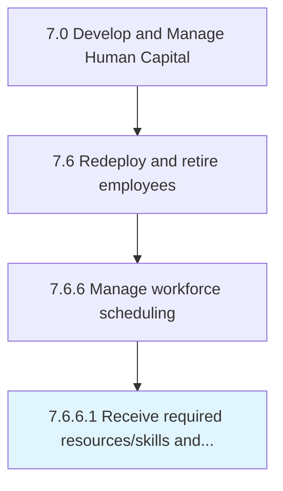

# Receive required resources/skills and capabilities

> Obtaining resources necessary to fill a position utilizing specific skills and capabilities.

## Overview

Activity 7.6.6.1 is an activity within the Develop and Manage Human Capital framework. 

Obtaining resources necessary to fill a position utilizing specific skills and capabilities.

## Process Hierarchy



## Key Statistics

| Metric | Value |
|--------|-------|
| APQC Code | 20133 |
| Hierarchy ID | 7.6.6.1 |
| Level | Activity |
| Parent | [7.6.6](../) |
| Sub-Processes | 0 |


## GraphDL Semantic Structure

```
receive.RequiredResourcesskillsAndCapabilities
```

| Component | Value | Description |
|-----------|-------|-------------|
| Verb | `receive` | Primary action |
| Object | `required resources/skills and capabilities` | Direct object |


## Related Concepts

- RequiredResources
- RequiredSkills
- Capabilities


---

*Source: APQC PCF 20133 (7.6.6.1) - APQC*
