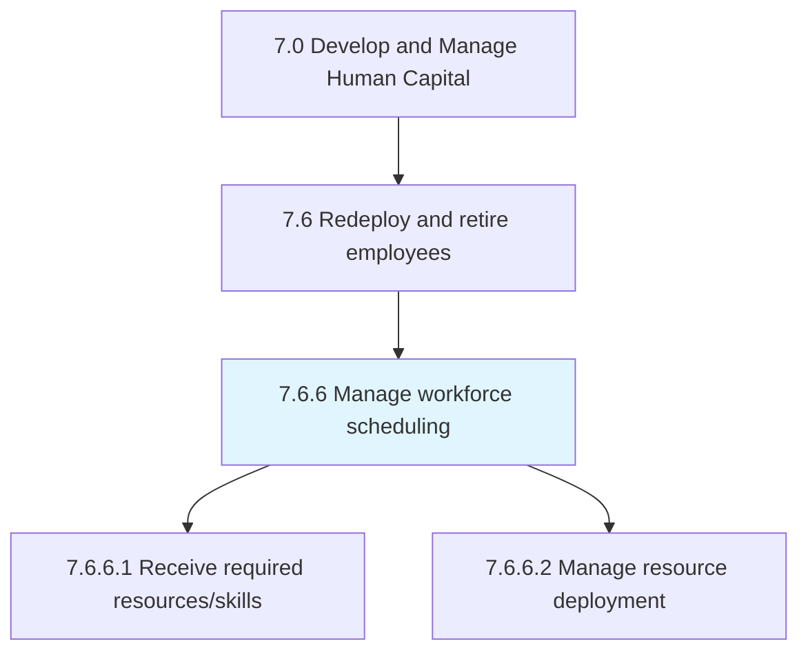
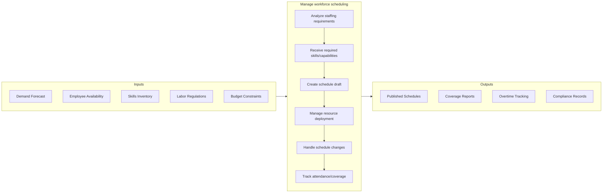

# Manage workforce scheduling

> Organizing the workforce so that all positions are covered for all shifts with the necessary skilled resources in place.

## Overview

Process 7.6.6 is a core process within [Redeploy and Retire Employees](../) that ensures optimal workforce coverage across all operational periods. This process matches available talent with business demands while considering employee preferences, labor regulations, and organizational constraints.

Effective workforce scheduling balances multiple competing objectives: maintaining adequate staffing levels, managing labor costs, ensuring regulatory compliance (overtime, rest periods), accommodating employee availability, and building in flexibility for unexpected absences. Modern scheduling leverages workforce management technology to optimize these tradeoffs while improving employee experience.

## Process Hierarchy



## Key Statistics

| Metric | Value |
|--------|-------|
| APQC Code | 20132 |
| Hierarchy ID | 7.6.6 |
| Level | Process |
| Parent | [7.6](../) |
| Sub-Processes | 2 |

## GraphDL Semantic Structure

```graphdl
manage.WorkforceScheduling
```

| Component | Value | Description |
|-----------|-------|-------------|
| Verb | `manage` | Primary action of administering |
| Object | `WorkforceScheduling` | Allocation of employees to shifts and assignments |

## Process Flow



## Sub-Processes

| Process | Hierarchy ID | Description |
|---------|-------------|-------------|
| [Receive required resources/skills and capabilities](./ReceiveRequiredResourcesskillsAndCapabilities) | 7.6.6.1 | Obtaining resources necessary to fill a position utilizing specific skills and capabilities |
| [Manage resource deployment](./ManageResourceDeployment) | 7.6.6.2 | Allocating employees to shifts, projects, and assignments based on skills and availability |

## RACI Matrix

| Activity | Responsible | Accountable | Consulted | Informed |
|----------|-------------|-------------|-----------|----------|
| Forecast staffing needs | Operations Planning | Operations Manager | HR, Finance | Supervisors |
| Define skill requirements | Department Managers | HR Director | Team Leads | Schedulers |
| Create schedules | Workforce Schedulers | Operations Manager | Employees, Union | HR |
| Approve schedules | Operations Manager | VP Operations | HR, Legal | Finance |
| Manage shift swaps | Team Supervisors | Workforce Schedulers | Employees | HR |
| Track compliance | HR Operations | HR Director | Legal | Management |

## Key Stakeholders

- **Operations Management**: Defines staffing requirements and approves schedules
- **Workforce Schedulers**: Creates and maintains schedules
- **Department Supervisors**: Manages day-to-day coverage and adjustments
- **HR Operations**: Ensures policy and regulatory compliance
- **Employees**: Provides availability and requests time off
- **Union Representatives**: Reviews schedules for collective agreement compliance

## Metrics and KPIs

| Metric | Description | Target |
|--------|-------------|--------|
| Schedule Coverage Rate | Percentage of shifts fully staffed | >98% |
| Overtime Hours | Overtime as percentage of total hours | <5% |
| Schedule Compliance | Adherence to published schedules | >95% |
| Advance Notice | Days schedule published in advance | >14 days |
| Shift Fill Time | Hours to fill open shifts | <4 hours |
| Employee Preference Match | Schedules matching employee preferences | >80% |
| Absence Rate | Unplanned absences as % of scheduled hours | <3% |
| Labor Cost Variance | Actual vs. budgeted labor cost | +/- 2% |

## Related Departments

- [Operations](/departments/Operations) - Staffing requirements and shift management
- [Human Resources](/departments/HumanResources) - Policy compliance and HRIS integration
- [Finance](/departments/Finance) - Labor budgeting and cost analysis
- [Legal](/departments/Legal) - Labor law compliance

## Related Occupations

- [Human Resources Specialists](/occupations/Business/HumanResourcesSpecialists) - Scheduling administration
- [Industrial Production Managers](/occupations/Management/IndustrialProductionManagers) - Production scheduling
- [First-Line Supervisors](/occupations/Management/FirstLineSupervisors) - Daily coverage management
- [Logisticians](/occupations/Business/Logisticians) - Resource optimization

## Related Concepts

- WorkforceManagement
- ShiftScheduling
- LaborOptimization
- CapacityPlanning
- TimeAndAttendance
- ContingentStaffing

---

*Source: APQC PCF 20132 (7.6.6) - APQC*
