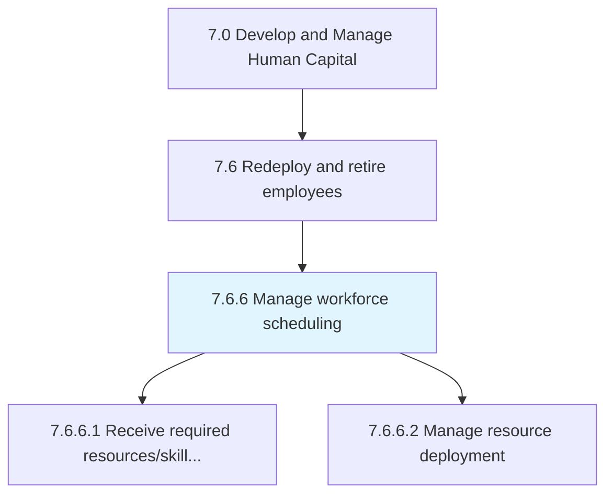
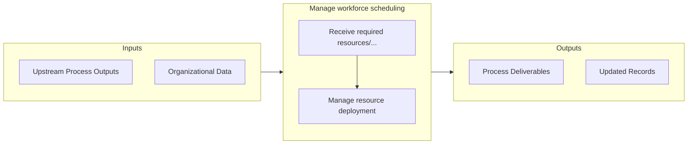

# Manage workforce scheduling

> Organizing the workforce so that all positions are covered for all shifts with the necessary skilled resources in place.

## Overview

Process 7.6.6 is a core process that defines the specific procedures for manage workforce scheduling. 

Organizing the workforce so that all positions are covered for all shifts with the necessary skilled resources in place. Have a system in place to backfill positions while an employee is on leave.

## Process Hierarchy



## Key Statistics

| Metric | Value |
|--------|-------|
| APQC Code | 20132 |
| Hierarchy ID | 7.6.6 |
| Level | Process |
| Parent | [7.6](../) |
| Sub-Processes | 2 |


## GraphDL Semantic Structure

```
manage.WorkforceScheduling
```

| Component | Value | Description |
|-----------|-------|-------------|
| Verb | `manage` | Primary action |
| Object | `workforce scheduling` | Direct object |


## Process Flow



## Sub-Processes

| Process | Hierarchy ID | Description |
|---------|-------------|-------------|
| [Receive required resources/skills and capabilities](./ReceiveRequiredResourcesskillsAndCapabilities) | 7.6.6.1 | Obtaining resources necessary to fill a position utilizing specific skills and capabilities |
| [Manage resource deployment](./ManageResourceDeployment) | 7.6.6.2 | Allocating employees |


## Related Concepts

- WorkforceScheduling


---

*Source: APQC PCF 20132 (7.6.6) - APQC*
