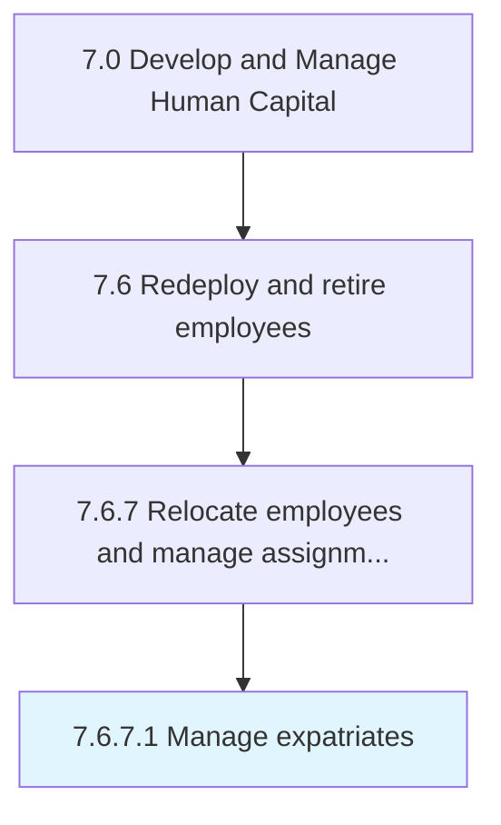

# Manage expatriates

> Managing foreign resources.

## Overview

Activity 7.6.7.1 is an activity within the Develop and Manage Human Capital framework. 

Managing foreign resources. Manage employees who are sent to live abroad for a defined time period, as well as non-native employees.

## Process Hierarchy



## Key Statistics

| Metric | Value |
|--------|-------|
| APQC Code | 10520 |
| Hierarchy ID | 7.6.7.1 |
| Level | Activity |
| Parent | [7.6.7](../) |
| Sub-Processes | 0 |


## GraphDL Semantic Structure

```
manage.Expatriates
```

| Component | Value | Description |
|-----------|-------|-------------|
| Verb | `manage` | Primary action |
| Object | `expatriates` | Direct object |


## Related Concepts

- [Expatriates](/concepts/Expatriates)


---

*Source: APQC PCF 10520 (7.6.7.1) - APQC*
