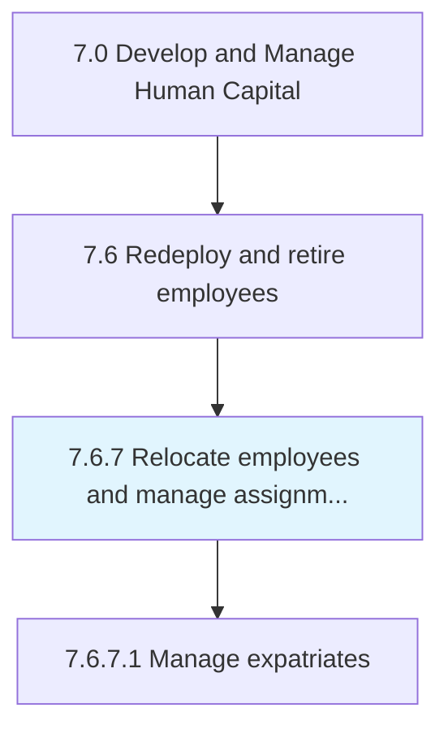
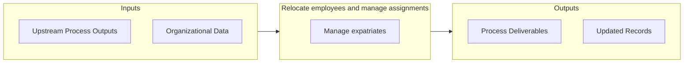

# Relocate employees and manage assignments

> Managing the relocation of employees in order to carry out assignments.

## Overview

Process 7.6.7 is a core process that defines the specific procedures for relocate employees and manage assignments. 

Managing the relocation of employees in order to carry out assignments. Manage internal business processes to transfer employees, their families, and/or entire departments of a business to a new location.

## Process Hierarchy



## Key Statistics

| Metric | Value |
|--------|-------|
| APQC Code | 17055 |
| Hierarchy ID | 7.6.7 |
| Level | Process |
| Parent | [7.6](../) |
| Sub-Processes | 1 |


## GraphDL Semantic Structure

```graphdl
relocate.EmployeesAndManageAssignments
```

| Component | Value | Description |
|-----------|-------|-------------|
| Verb | `relocate` | Primary action |
| Object | `employees and manage assignments` | Direct object |


## Process Flow



## Sub-Processes

| Process | Hierarchy ID | Description |
|---------|-------------|-------------|
| [Manage expatriates](./ManageExpatriates) | 7.6.7.1 | Managing foreign resources |


## Related Concepts

- Employees
- ManageAssignments


---

*Source: APQC PCF 17055 (7.6.7) - APQC*
