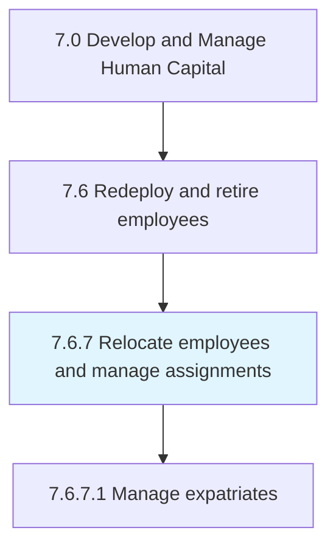
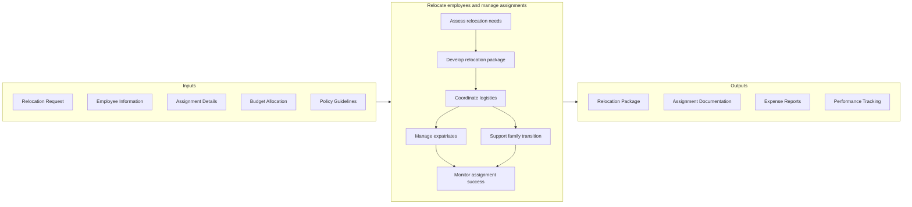

# Relocate employees and manage assignments

> Managing the relocation of employees in order to carry out assignments.

## Overview

Process 7.6.7 is a core process within [Redeploy and Retire Employees](../) that manages the complex logistics of employee relocation and international assignments. This process ensures employees, their families, and sometimes entire departments can effectively transition to new locations while maintaining productivity and minimizing disruption.

Employee relocation encompasses domestic transfers, international assignments, expatriate management, and repatriation. Effective management requires coordination across HR, legal, finance, and external relocation service providers to address visa/immigration requirements, housing, cost-of-living adjustments, family support services, and cultural integration.

## Process Hierarchy



## Key Statistics

| Metric | Value |
|--------|-------|
| APQC Code | 17055 |
| Hierarchy ID | 7.6.7 |
| Level | Process |
| Parent | [7.6](../) |
| Sub-Processes | 1 |

## GraphDL Semantic Structure

```graphdl
relocate.Employees.for.Assignments
```

| Component | Value | Description |
|-----------|-------|-------------|
| Verb | `relocate` | Primary action of moving employees |
| Object | `Employees` | Workforce members being transferred |
| Preposition | `for` | Purpose relationship |
| PrepObject | `Assignments` | Work assignments requiring relocation |

## Process Flow



## Sub-Processes

| Process | Hierarchy ID | Description |
|---------|-------------|-------------|
| [Manage expatriates](./ManageExpatriates) | 7.6.7.1 | Managing foreign resources including visa sponsorship, tax equalization, cultural training, and repatriation planning |

## RACI Matrix

| Activity | Responsible | Accountable | Consulted | Informed |
|----------|-------------|-------------|-----------|----------|
| Assess relocation needs | HR Business Partner | HR Director | Hiring Manager, Employee | Finance |
| Develop relocation package | Global Mobility Team | VP HR | Legal, Tax | Employee |
| Coordinate logistics | Relocation Provider | Global Mobility Manager | Employee, Destination HR | Manager |
| Manage visa/immigration | Immigration Counsel | Global Mobility Manager | Employee | HR Operations |
| Support family transition | Employee Assistance | Global Mobility Manager | Employee, Family | Manager |
| Monitor assignment success | Local HR | HR Director | Manager, Employee | Executive Team |

## Key Stakeholders

- **Global Mobility Team**: Designs and administers relocation policies
- **HR Business Partners**: Coordinates with business units on assignment needs
- **Legal/Immigration**: Manages visa and work permit requirements
- **Finance/Tax**: Handles tax equalization and cost tracking
- **Relocation Service Providers**: Executes logistics and family support
- **Hiring Managers**: Defines assignment requirements and success criteria
- **Employees and Families**: Primary beneficiaries requiring support

## Metrics and KPIs

| Metric | Description | Target |
|--------|-------------|--------|
| Assignment Acceptance Rate | Percentage of offered relocations accepted | >85% |
| Relocation Cost per Move | Average total cost of relocation | Industry benchmark |
| Time to Productive | Days from move to full productivity | <90 days |
| Assignment Completion Rate | Percentage completing full assignment | >90% |
| Employee Satisfaction | Relocated employee satisfaction score | >80% |
| Family Adjustment Score | Family adaptation to new location | >75% |
| Policy Compliance Rate | Adherence to relocation policies | >95% |
| Repatriation Success | Successful return and retention at 1 year | >80% |

## Related Departments

- [Human Resources](/departments/HumanResources) - Policy development and administration
- [Legal](/departments/Legal) - Immigration and contract compliance
- [Finance](/departments/Finance) - Budget management and tax equalization
- [Global Operations](/departments/Operations) - International assignment coordination

## Related Occupations

- [Human Resources Managers](/occupations/Management/HumanResourcesManagers) - Relocation program oversight
- [Compensation and Benefits Managers](/occupations/Management/CompensationBenefitsManagers) - Package design
- [Training and Development Managers](/occupations/Management/TrainingDevelopmentManagers) - Cultural training
- [Logisticians](/occupations/Business/Logisticians) - Move coordination

## Related Concepts

- GlobalMobility
- ExpatriateManagement
- RelocationServices
- InternationalAssignments
- TaxEqualization
- ImmigrationCompliance

---

*Source: APQC PCF 17055 (7.6.7) - APQC*
