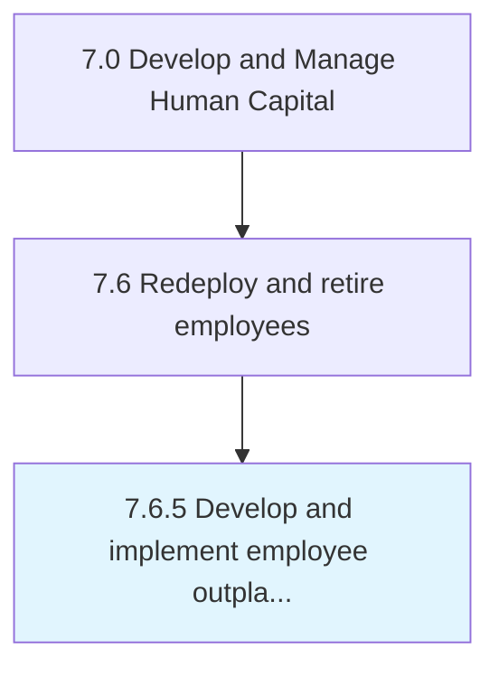

# Develop and implement employee outplacement

> Helping former employees transition to new jobs or to re-orient themselves in the job market.

## Overview

Process 7.6.5 is a core process that defines the specific procedures for develop and implement employee outplacement. 

Helping former employees transition to new jobs or to re-orient themselves in the job market. Deliver help through one-on-one sessions or in a group format. Provide guidance in career evaluation, resume writing, interview preparation, developing networks, and job searching.

## Process Hierarchy



## Key Statistics

| Metric | Value |
|--------|-------|
| APQC Code | 10516 |
| Hierarchy ID | 7.6.5 |
| Level | Process |
| Parent | [7.6](../) |
| Sub-Processes | 0 |


## GraphDL Semantic Structure

```
develop.AndImplementEmployeeOutplacement
```

| Component | Value | Description |
|-----------|-------|-------------|
| Verb | `develop` | Primary action |
| Object | `and implement employee outplacement` | Direct object |


## Related Concepts

- [EmployeeOutplacement](/concepts/EmployeeOutplacement)
- [EmployeeOutplacement](/concepts/EmployeeOutplacement)


---

*Source: APQC PCF 10516 (7.6.5) - APQC*
