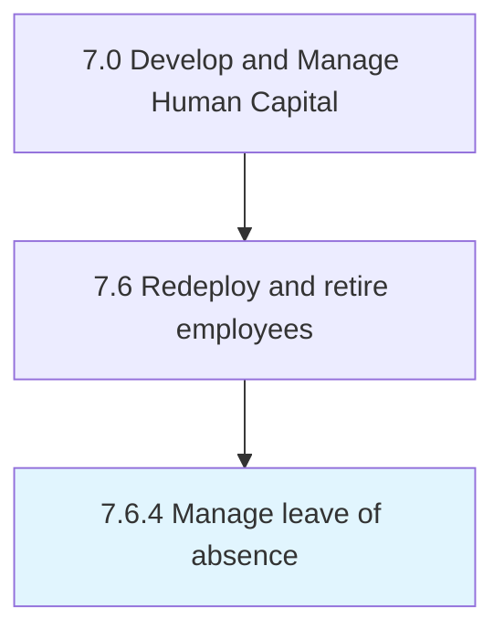

# Manage leave of absence

> Managing the period of time that an employee must be away from their primary job, while maintaining the status of employee (i.

## Overview

Process 7.6.4 is a core process that defines the specific procedures for manage leave of absence. 

Managing the period of time that an employee must be away from their primary job, while maintaining the status of employee (i.e., paid and unpaid leave of absence but not vacations, holidays, hiatuses, sabbaticals, and work-from-home programs).

## Process Hierarchy



## Key Statistics

| Metric | Value |
|--------|-------|
| APQC Code | 10515 |
| Hierarchy ID | 7.6.4 |
| Level | Process |
| Parent | [7.6](../) |
| Sub-Processes | 0 |


## GraphDL Semantic Structure

```
manage.Leave.of.Absence
```

| Component | Value | Description |
|-----------|-------|-------------|
| Verb | `manage` | Primary action |
| Object | `leave` | Direct object |
| Preposition | `of` | Relationship |
| PrepObject | `absence` | Indirect object |


## Related Concepts

- [Leave](/concepts/Leave)
- [Absence](/concepts/Absence)


---

*Source: APQC PCF 10515 (7.6.4) - APQC*
