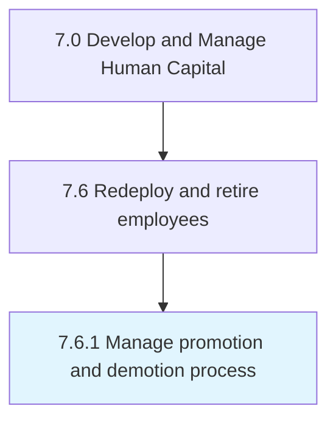

# Manage promotion and demotion process

> Administering the process of promoting and demoting employees.

## Overview

Process 7.6.1 is a core process that defines the specific procedures for manage promotion and demotion process. 

Administering the process of promoting and demoting employees. Design a system for advancing or demoting an employee's rank or position. Leverage techniques such as horizontal promotion, vertical promotion, dry promotion, and involuntary/voluntary demotion.

## Process Hierarchy



## Key Statistics

| Metric | Value |
|--------|-------|
| APQC Code | 10512 |
| Hierarchy ID | 7.6.1 |
| Level | Process |
| Parent | [7.6](../) |
| Sub-Processes | 0 |


## GraphDL Semantic Structure

```
manage.PromotionAndDemotionProcess
```

| Component | Value | Description |
|-----------|-------|-------------|
| Verb | `manage` | Primary action |
| Object | `promotion and demotion process` | Direct object |


## Related Concepts

- PromotionProcess
- DemotionProcess


---

*Source: APQC PCF 10512 (7.6.1) - APQC*
