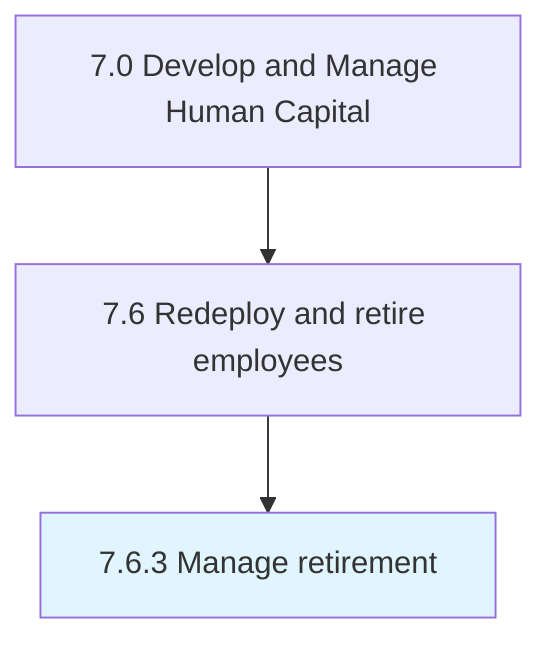

# Manage retirement

> Managing and administering instances where a person stops employment completely.

## Overview

Process 7.6.3 is a core process that defines the specific procedures for manage retirement. 

Managing and administering instances where a person stops employment completely.

## Process Hierarchy



## Key Statistics

| Metric | Value |
|--------|-------|
| APQC Code | 10514 |
| Hierarchy ID | 7.6.3 |
| Level | Process |
| Parent | [7.6](../) |
| Sub-Processes | 0 |


## GraphDL Semantic Structure

```
manage.Retirement
```

| Component | Value | Description |
|-----------|-------|-------------|
| Verb | `manage` | Primary action |
| Object | `retirement` | Direct object |


## Related Concepts

- Retirement


---

*Source: APQC PCF 10514 (7.6.3) - APQC*
