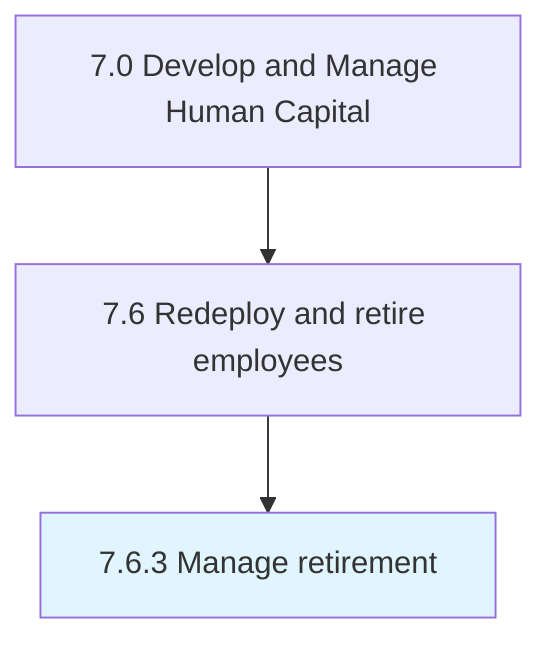
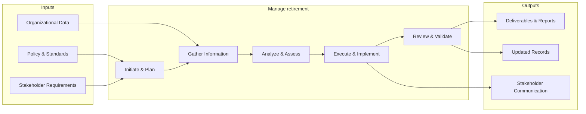

# Manage retirement

> Managing and administering instances where a person stops employment completely.

## Overview

Process 7.6.3 is a core process that defines the specific procedures for manage retirement. 

Managing and administering instances where a person stops employment completely.

This process provides a structured approach to managing retirement across the organization. It includes establishing governance frameworks, defining operational procedures, monitoring performance, ensuring compliance with policies and regulations, and driving continuous improvement through data-driven insights.

## Process Hierarchy



## Key Statistics

| Metric | Value |
|--------|-------|
| APQC Code | 10514 |
| Hierarchy ID | 7.6.3 |
| Level | Process |
| Parent | [7.6](../) |
| Sub-Processes | 0 |


## GraphDL Semantic Structure

```
manage.Retirement
```

| Component | Value | Description |
|-----------|-------|-------------|
| Verb | `manage` | Primary action |
| Object | `retirement` | Direct object |


## Related Concepts

- Retirement


## Process Flow



## RACI Matrix

| Activity | Responsible | Accountable | Consulted | Informed |
|----------|------------|-------------|-----------|----------|
| Process separation | HR Specialist | HR Manager | Legal Counsel | Department Head |
| Manage redeployment | HR Business Partner | HR Director | Department Heads | Employee |
| Administer retirement | Benefits Specialist | Benefits Manager | Finance | Employee |

## Related Occupations

- [Human Resources Managers](/occupations/HumanResourcesManagers)
- [Human Resources Specialists](/occupations/HumanResourcesSpecialists)
- [Training and Development Managers](/occupations/TrainingAndDevelopmentManagers)
- [Compensation and Benefits Managers](/occupations/CompensationAndBenefitsManagers)
- [Management Analysts](/occupations/ManagementAnalysts)

## Related Departments

- Human Resources
- Operations
- Finance

## Industry Variations

### Technology

Manages frequent internal mobility, project-based redeployment, remote work transitions, and knowledge transfer during rapid organizational changes.

### Manufacturing

Handles plant closures, production line reassignments, early retirement packages, and retraining programs for displaced workers.

### Public Sector

Follows civil service redeployment rules, seniority-based reassignment, pension considerations, and mandatory retirement age policies.

## KPIs & Metrics

| Metric | Description | Target |
|--------|-------------|--------|
| Internal Mobility Rate | Percentage of roles filled through internal transfers | > 25% |
| Redeployment Success Rate | Percentage of redeployed employees retained after 12 months | > 80% |
| Separation Processing Time | Average days to complete separation process | < 5 days |
| Retirement Readiness Score | Percentage of eligible employees with retirement plans | > 90% |

---

*Source: APQC PCF 10514 (7.6.3) - APQC*
