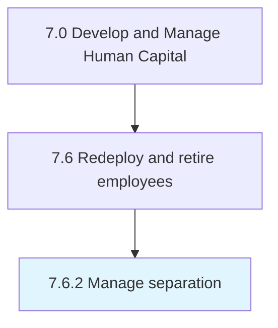

# Manage separation

> Managing the process of employee separation, including resignations, discharges, and layoffs.

## Overview

Process 7.6.2 is a core process that defines the specific procedures for manage separation. 

Managing the process of employee separation, including resignations, discharges, and layoffs. Inform the employee of the termination. Complete paperwork for continuation of benefits.

## Process Hierarchy



## Key Statistics

| Metric | Value |
|--------|-------|
| APQC Code | 10513 |
| Hierarchy ID | 7.6.2 |
| Level | Process |
| Parent | [7.6](../) |
| Sub-Processes | 0 |


## GraphDL Semantic Structure

```
manage.Separation
```

| Component | Value | Description |
|-----------|-------|-------------|
| Verb | `manage` | Primary action |
| Object | `separation` | Direct object |


## Related Concepts

- Separation


---

*Source: APQC PCF 10513 (7.6.2) - APQC*
