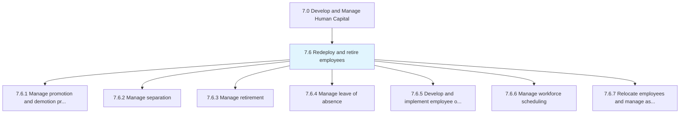
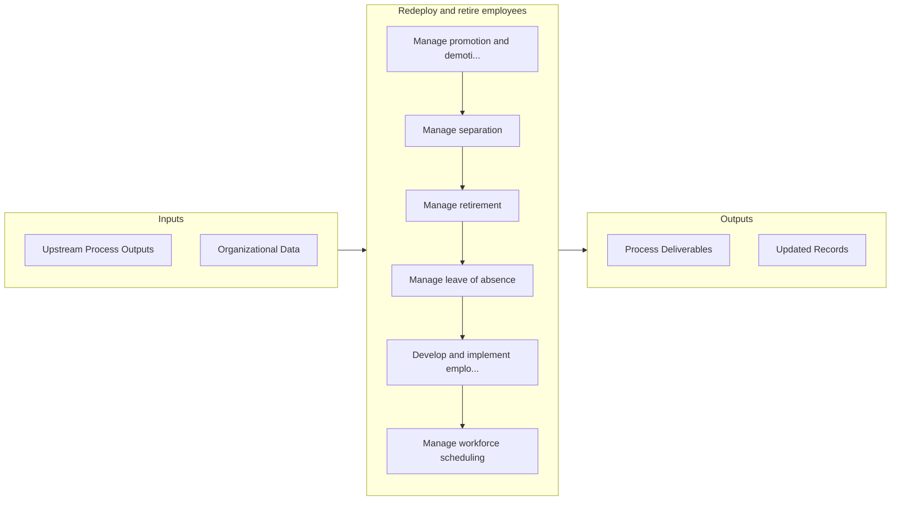

# Redeploy and retire employees

> Managing the reassignment and retirement of employees.

## Overview

Group 7.6 is a process group within APQC Category 7.0 (Develop and Manage Human Capital). 

Managing the reassignment and retirement of employees. Manage the process of employee promotion and demotion. Administer separation, retirement, and leaves of absence. Outplace employees. Deploy personnel. Relocate employees in order to manage assignments.

## Process Hierarchy



## Key Statistics

| Metric | Value |
|--------|-------|
| APQC Code | 10413 |
| Hierarchy ID | 7.6 |
| Level | Group |
| Parent | [7](../) |
| Sub-Processes | 7 |


## GraphDL Semantic Structure

```
redeploy.AndRetireEmployees
```

| Component | Value | Description |
|-----------|-------|-------------|
| Verb | `redeploy` | Primary action |
| Object | `and retire employees` | Direct object |


## Process Flow



## Sub-Processes

| Process | Hierarchy ID | Description |
|---------|-------------|-------------|
| [Manage promotion and demotion process](./ManagePromotionAndDemotionProcess) | 7.6.1 | Administering the process of promoting and demoting employees |
| [Manage separation](./ManageSeparation) | 7.6.2 | Managing the process of employee separation, including resignations, discharges, and layoffs |
| [Manage retirement](./ManageRetirement) | 7.6.3 | Managing and administering instances where a person stops employment completely |
| [Manage leave of absence](./ManageLeaveOfAbsence) | 7.6.4 | Managing the period of time that an employee must be away from their primary job, while maintaining  |
| [Develop and implement employee outplacement](./DevelopAndImplementEmployeeOutplacement) | 7.6.5 | Helping former employees transition to new jobs or to re-orient themselves in the job market |
| [Manage workforce scheduling](./7.6.6-ManageWorkforceScheduling/) | 7.6.6 | Organizing the workforce so that all positions are covered for all shifts with the necessary skilled |
| [Relocate employees and manage assignments](./7.6.7-RelocateEmployeesManageAssignments/) | 7.6.7 | Managing the relocation of employees in order to carry out assignments |


## Related Concepts

- [Employees](/concepts/Employees)
- [Employees](/concepts/Employees)


---

*Source: APQC PCF 10413 (7.6) - APQC*
