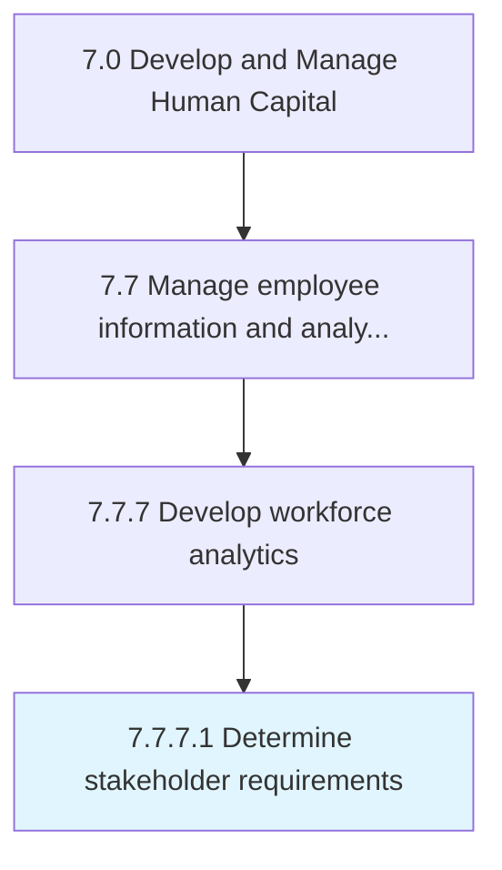

# Determine stakeholder requirements

> Collect and manage requirements from various enterprise stakeholders about workforce analytics.

## Overview

Activity 7.7.7.1 is an activity within the Develop and Manage Human Capital framework. 

Collect and manage requirements from various enterprise stakeholders about workforce analytics.

## Process Hierarchy



## Key Statistics

| Metric | Value |
|--------|-------|
| APQC Code | 21442 |
| Hierarchy ID | 7.7.7.1 |
| Level | Activity |
| Parent | [7.7.7](../) |
| Sub-Processes | 0 |


## GraphDL Semantic Structure

```
determine.StakeholderRequirements
```

| Component | Value | Description |
|-----------|-------|-------------|
| Verb | `determine` | Primary action |
| Object | `stakeholder requirements` | Direct object |


## Related Concepts

- StakeholderRequirements


---

*Source: APQC PCF 21442 (7.7.7.1) - APQC*
