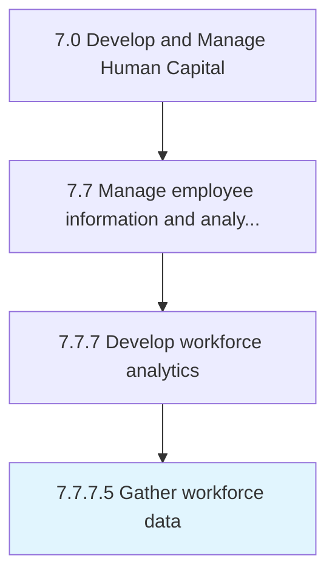

# Gather workforce data

> Collect and procure, as needed, workforce data from internal and external data sources in support of workforce analytics.

## Overview

Activity 7.7.7.5 is an activity within the Develop and Manage Human Capital framework. 

Collect and procure, as needed, workforce data from internal and external data sources in support of workforce analytics.

## Process Hierarchy



## Key Statistics

| Metric | Value |
|--------|-------|
| APQC Code | 21446 |
| Hierarchy ID | 7.7.7.5 |
| Level | Activity |
| Parent | [7.7.7](../) |
| Sub-Processes | 0 |


## GraphDL Semantic Structure

```
gather.WorkforceData
```

| Component | Value | Description |
|-----------|-------|-------------|
| Verb | `gather` | Primary action |
| Object | `workforce data` | Direct object |


## Related Concepts

- [WorkforceData](/concepts/WorkforceData)


---

*Source: APQC PCF 21446 (7.7.7.5) - APQC*
