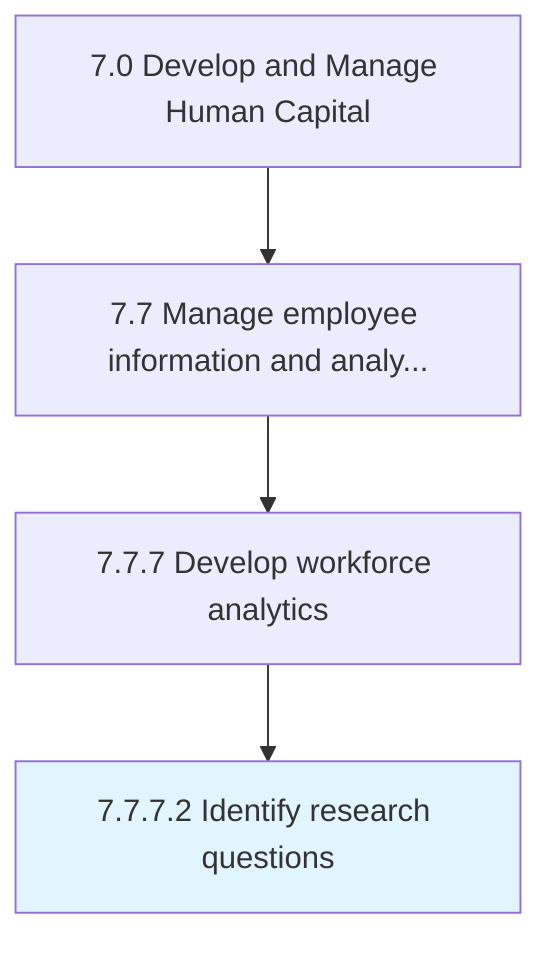

# Identify research questions

> Summarize stakeholder requirements into discrete research questions in support of workforce analytics.

## Overview

Activity 7.7.7.2 is an activity within the Develop and Manage Human Capital framework. 

Summarize stakeholder requirements into discrete research questions in support of workforce analytics.

## Process Hierarchy



## Key Statistics

| Metric | Value |
|--------|-------|
| APQC Code | 21443 |
| Hierarchy ID | 7.7.7.2 |
| Level | Activity |
| Parent | [7.7.7](../) |
| Sub-Processes | 0 |


## GraphDL Semantic Structure

```
identify.ResearchQuestions
```

| Component | Value | Description |
|-----------|-------|-------------|
| Verb | `identify` | Primary action |
| Object | `research questions` | Direct object |


## Related Concepts

- ResearchQuestions


---

*Source: APQC PCF 21443 (7.7.7.2) - APQC*
