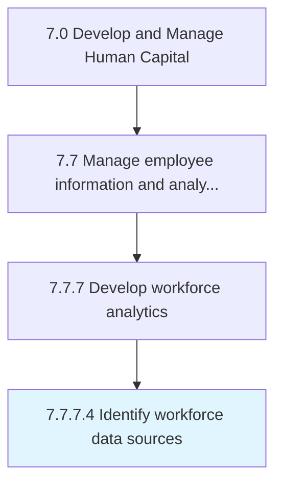

# Identify workforce data sources

> Identify appropriate data sources for workforce analytics data while considering organizational standards for data sources.

## Overview

Activity 7.7.7.4 is an activity within the Develop and Manage Human Capital framework. 

Identify appropriate data sources for workforce analytics data while considering organizational standards for data sources.

## Process Hierarchy



## Key Statistics

| Metric | Value |
|--------|-------|
| APQC Code | 21445 |
| Hierarchy ID | 7.7.7.4 |
| Level | Activity |
| Parent | [7.7.7](../) |
| Sub-Processes | 0 |


## GraphDL Semantic Structure

```
identify.WorkforceDataSources
```

| Component | Value | Description |
|-----------|-------|-------------|
| Verb | `identify` | Primary action |
| Object | `workforce data sources` | Direct object |


## Related Concepts

- WorkforceDataSources


---

*Source: APQC PCF 21445 (7.7.7.4) - APQC*
