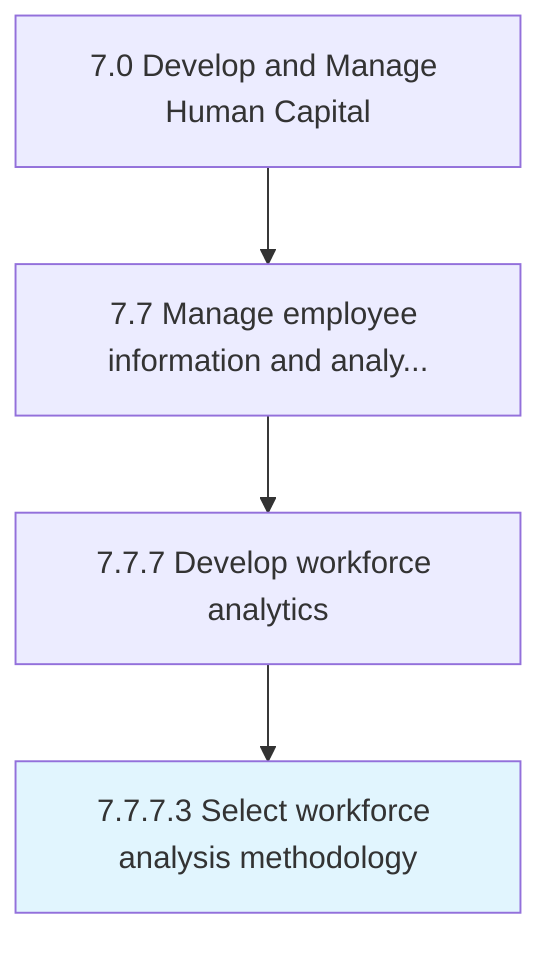

# Select workforce analysis methodology

> Consider stakeholder requirements, research questions, and organizations standards around research to select appropriate research methodology in support of workforce analytics.

## Overview

Activity 7.7.7.3 is an activity within the Develop and Manage Human Capital framework. 

Consider stakeholder requirements, research questions, and organizations standards around research to select appropriate research methodology in support of workforce analytics.

## Process Hierarchy



## Key Statistics

| Metric | Value |
|--------|-------|
| APQC Code | 21444 |
| Hierarchy ID | 7.7.7.3 |
| Level | Activity |
| Parent | [7.7.7](../) |
| Sub-Processes | 0 |


## GraphDL Semantic Structure

```
select.WorkforceAnalysisMethodology
```

| Component | Value | Description |
|-----------|-------|-------------|
| Verb | `select` | Primary action |
| Object | `workforce analysis methodology` | Direct object |


## Related Concepts

- WorkforceAnalysisMethodology


---

*Source: APQC PCF 21444 (7.7.7.3) - APQC*
