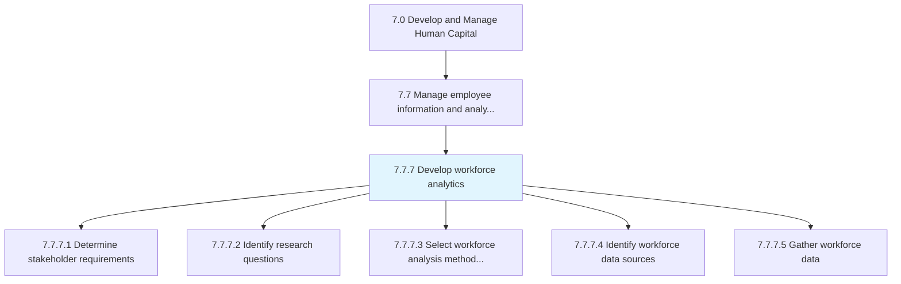
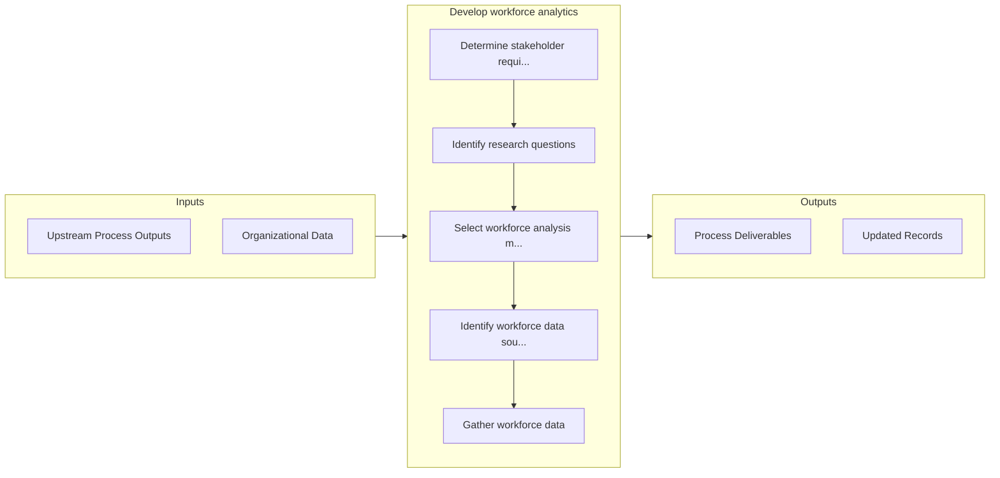

# Develop workforce analytics

> Understand, develop, and gather workforce data in support of stakeholder requirements.

## Overview

Process 7.7.7 is a core process that defines the specific procedures for develop workforce analytics. 

Understand, develop, and gather workforce data in support of stakeholder requirements.

## Process Hierarchy



## Key Statistics

| Metric | Value |
|--------|-------|
| APQC Code | 21441 |
| Hierarchy ID | 7.7.7 |
| Level | Process |
| Parent | [7.7](../) |
| Sub-Processes | 5 |


## GraphDL Semantic Structure

```graphdl
develop.WorkforceAnalytics
```

| Component | Value | Description |
|-----------|-------|-------------|
| Verb | `develop` | Primary action |
| Object | `workforce analytics` | Direct object |


## Process Flow



## Sub-Processes

| Process | Hierarchy ID | Description |
|---------|-------------|-------------|
| [Determine stakeholder requirements](./DetermineStakeholderRequirements) | 7.7.7.1 | Collect and manage requirements from various enterprise stakeholders about workforce analytics |
| [Identify research questions](./IdentifyResearchQuestions) | 7.7.7.2 | Summarize stakeholder requirements into discrete research questions in support of workforce analytic |
| [Select workforce analysis methodology](./SelectWorkforceAnalysisMethodology) | 7.7.7.3 | Consider stakeholder requirements, research questions, and organizations standards around research t |
| [Identify workforce data sources](./IdentifyWorkforceDataSources) | 7.7.7.4 | Identify appropriate data sources for workforce analytics data while considering organizational stan |
| [Gather workforce data](./GatherWorkforceData) | 7.7.7.5 | Collect and procure, as needed, workforce data from internal and external data sources in support of |


## Related Concepts

- WorkforceAnalytics


---

*Source: APQC PCF 21441 (7.7.7) - APQC*
