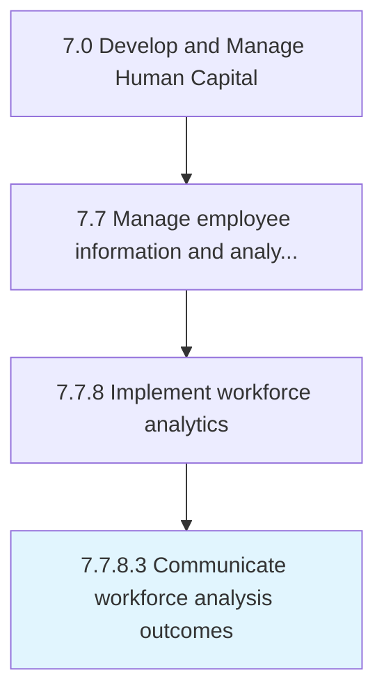

# Communicate workforce analysis outcomes

> Summarize, package, and distribute results of workforce analysis.

## Overview

Activity 7.7.8.3 is an activity within the Develop and Manage Human Capital framework. 

Summarize, package, and distribute results of workforce analysis.

## Process Hierarchy



## Key Statistics

| Metric | Value |
|--------|-------|
| APQC Code | 21450 |
| Hierarchy ID | 7.7.8.3 |
| Level | Activity |
| Parent | [7.7.8](../) |
| Sub-Processes | 0 |


## GraphDL Semantic Structure

```
communicate.WorkforceAnalysisOutcomes
```

| Component | Value | Description |
|-----------|-------|-------------|
| Verb | `communicate` | Primary action |
| Object | `workforce analysis outcomes` | Direct object |


## Related Concepts

- WorkforceAnalysisOutcomes


---

*Source: APQC PCF 21450 (7.7.8.3) - APQC*
