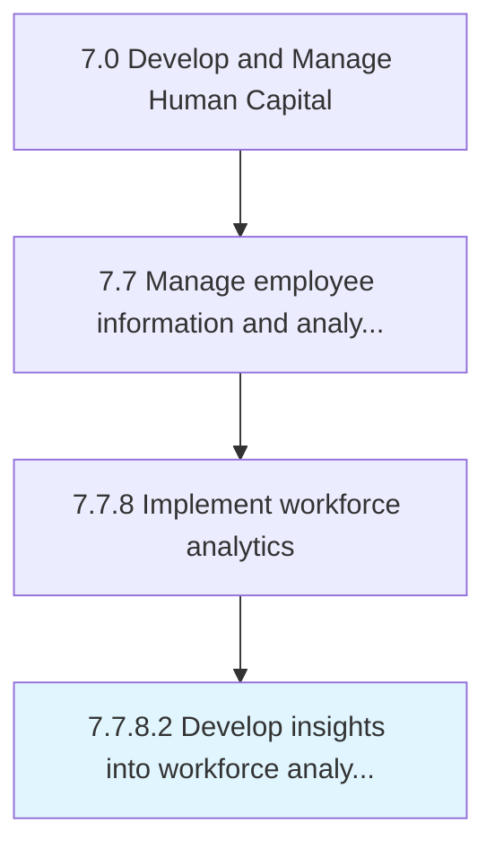

# Develop insights into workforce analytics outcomes

> Synthesize insights from workforce analytics data.

## Overview

Activity 7.7.8.2 is an activity within the Develop and Manage Human Capital framework. 

## Process Hierarchy



## Key Statistics

| Metric | Value |
|--------|-------|
| APQC Code | 21449 |
| Hierarchy ID | 7.7.8.2 |
| Level | Activity |
| Parent | [7.7.8](../) |
| Sub-Processes | 0 |


## GraphDL Semantic Structure

```
develop.Insights.into.WorkforceAnalyticsOutcomes
```

| Component | Value | Description |
|-----------|-------|-------------|
| Verb | `develop` | Primary action |
| Object | `insights` | Direct object |
| Preposition | `into` | Relationship |
| PrepObject | `workforce analytics outcomes` | Indirect object |


## Related Concepts

- Insights
- WorkforceAnalyticsOutcomes


---

*Source: APQC PCF 21449 (7.7.8.2) - APQC*
