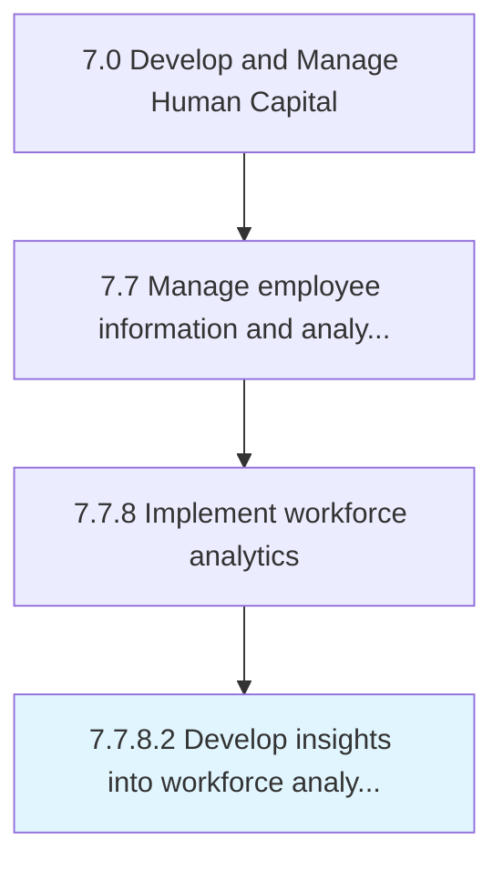
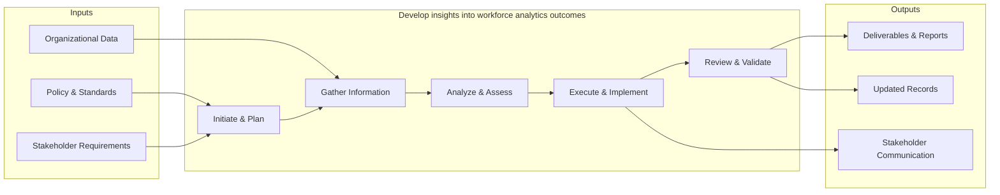

# Develop insights into workforce analytics outcomes

> Synthesize insights from workforce analytics data.

## Overview

Activity 7.7.8.2 is an activity within the Develop and Manage Human Capital framework. 

This process encompasses the end-to-end development of insights.into. workforce analytics outcomes, from initial needs assessment through design, implementation, and evaluation. It requires cross-functional collaboration, alignment with organizational objectives, and iterative refinement based on stakeholder feedback and performance metrics.

## Process Hierarchy



## Key Statistics

| Metric | Value |
|--------|-------|
| APQC Code | 21449 |
| Hierarchy ID | 7.7.8.2 |
| Level | Activity |
| Parent | [7.7.8](../) |
| Sub-Processes | 0 |


## GraphDL Semantic Structure

```graphdl
develop.Insights.into.WorkforceAnalyticsOutcomes
```

| Component | Value | Description |
|-----------|-------|-------------|
| Verb | `develop` | Primary action |
| Object | `insights` | Direct object |
| Preposition | `into` | Relationship |
| PrepObject | `workforce analytics outcomes` | Indirect object |


## Related Concepts

- Insights
- WorkforceAnalyticsOutcomes


## Process Flow



## RACI Matrix

| Activity | Responsible | Accountable | Consulted | Informed |
|----------|------------|-------------|-----------|----------|
| Maintain HRIS | HRIS Analyst | HRIS Manager | IT | HR Director |
| Generate reports | HR Analyst | HR Director | Department Heads | C-Suite |
| Analyze workforce data | People Analytics Specialist | HR Director | Data Science | Leadership |

## Related Occupations

- [Human Resources Managers](/occupations/Management/HumanResourcesManagers)
- [Management Analysts](/occupations/Business/Operations/ManagementAnalysts)
- [Database Administrators](/occupations/Technology/DatabaseAdministrators)
- [Statisticians](/occupations/Technology/Statisticians)
- [Human Resources Specialists](/occupations/Business/Operations/HumanResourcesSpecialists)

## Related Departments

- Human Resources
- Information Technology
- Analytics

## Industry Variations

### Technology

Leverages advanced people analytics platforms, AI-driven workforce insights, real-time dashboards, and predictive attrition modeling.

### Healthcare

Tracks credential expirations, staffing ratios, overtime compliance, and integrates with clinical scheduling and EHR systems.

### Financial Services

Maintains strict data privacy controls, regulatory reporting requirements, compensation benchmarking data, and audit-ready employee records.

## KPIs & Metrics

| Metric | Description | Target |
|--------|-------------|--------|
| Data Accuracy Rate | Percentage of employee records without errors | > 99% |
| Report Generation Time | Average time to produce standard workforce reports | < 4 hours |
| HRIS System Uptime | System availability percentage | > 99.5% |
| Analytics Adoption Rate | Percentage of HR leaders using analytics dashboards | > 75% |

---

*Source: APQC PCF 21449 (7.7.8.2) - APQC*
