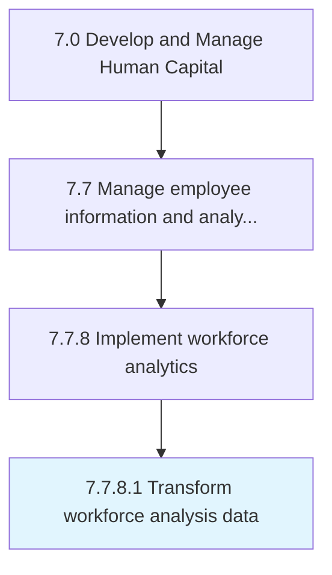

# Transform workforce analysis data

> Logically and statistically validate collected or purchased data in support of analytics needs.

## Overview

Activity 7.7.8.1 is an activity within the Develop and Manage Human Capital framework. 

Logically and statistically validate collected or purchased data in support of analytics needs

## Process Hierarchy



## Key Statistics

| Metric | Value |
|--------|-------|
| APQC Code | 21448 |
| Hierarchy ID | 7.7.8.1 |
| Level | Activity |
| Parent | [7.7.8](../) |
| Sub-Processes | 0 |


## GraphDL Semantic Structure

```
transform.WorkforceAnalysisData
```

| Component | Value | Description |
|-----------|-------|-------------|
| Verb | `transform` | Primary action |
| Object | `workforce analysis data` | Direct object |


## Related Concepts

- [WorkforceAnalysisData](/concepts/WorkforceAnalysisData)


---

*Source: APQC PCF 21448 (7.7.8.1) - APQC*
