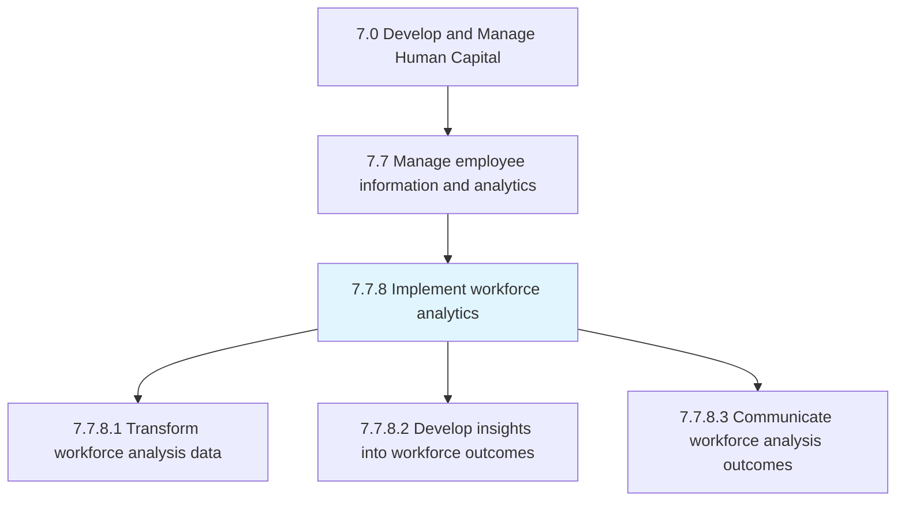
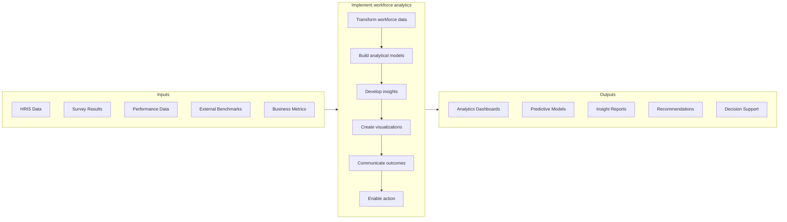

# Implement workforce analytics

> Transform, develop, and communicate workforce data into analytics in support of organizational requirements.

## Overview

Process 7.7.8 is a core process within [Manage Employee Information and Analytics](../) that transforms raw HR data into actionable insights for strategic decision-making. This process enables evidence-based human capital management by applying statistical analysis, predictive modeling, and data visualization to workforce information.

Workforce analytics has evolved from basic reporting to advanced predictive and prescriptive capabilities. Modern implementations leverage machine learning for talent predictions, natural language processing for sentiment analysis, and network analysis for collaboration insights. The process requires careful attention to data quality, privacy, ethics, and effective communication of findings to drive organizational action.

## Process Hierarchy



## Key Statistics

| Metric | Value |
|--------|-------|
| APQC Code | 21447 |
| Hierarchy ID | 7.7.8 |
| Level | Process |
| Parent | [7.7](../) |
| Sub-Processes | 3 |

## GraphDL Semantic Structure

```graphdl
implement.WorkforceAnalytics.for.OrganizationalDecisions
```

| Component | Value | Description |
|-----------|-------|-------------|
| Verb | `implement` | Primary action of putting into practice |
| Object | `WorkforceAnalytics` | Data-driven HR insights |
| Preposition | `for` | Purpose relationship |
| PrepObject | `OrganizationalDecisions` | Business decision support |

## Process Flow



## Sub-Processes

| Process | Hierarchy ID | Description |
|---------|-------------|-------------|
| [Transform workforce analysis data](./TransformWorkforceAnalysisData) | 7.7.8.1 | Cleanse, validate, and prepare data for statistical analysis |
| [Develop insights into workforce analytics outcomes](./DevelopInsightsIntoWorkforceAnalyticsOutcomes) | 7.7.8.2 | Apply analytical methods to generate meaningful workforce insights |
| [Communicate workforce analysis outcomes](./CommunicateWorkforceAnalysisOutcomes) | 7.7.8.3 | Package and present findings to drive organizational decisions |

## RACI Matrix

| Activity | Responsible | Accountable | Consulted | Informed |
|----------|-------------|-------------|-----------|----------|
| Define analytics priorities | HR Analytics Lead | CHRO | Business Leaders | HR Team |
| Build data pipelines | Data Engineers | Analytics Manager | IT, HRIS | HR Operations |
| Develop analytical models | Data Scientists | Analytics Manager | HR Subject Experts | Business Partners |
| Create dashboards | Analytics Analysts | Analytics Manager | End Users | Leadership |
| Communicate insights | HR Business Partners | CHRO | Business Leaders | Managers |
| Ensure data privacy | Legal/Compliance | CHRO | IT Security | Analytics Team |

## Key Stakeholders

- **HR Analytics Team**: Develops and implements analytical capabilities
- **CHRO/HR Leadership**: Sponsors analytics initiatives, acts on insights
- **Business Leaders**: Consume insights for workforce decisions
- **HR Business Partners**: Translate insights into actions
- **IT/Data Engineering**: Supports technical infrastructure
- **Legal/Compliance**: Ensures ethical data use and privacy

## Metrics and KPIs

| Metric | Description | Target |
|--------|-------------|--------|
| Analytics Adoption Rate | Percentage of leaders using analytics tools | >75% |
| Decision Impact | Business outcomes improved by analytics | Documented |
| Prediction Accuracy | Accuracy of turnover/performance predictions | >80% |
| Data Quality Score | Completeness and accuracy of source data | >95% |
| Insight-to-Action Time | Days from insight to decision | <30 days |
| Self-Service Usage | Queries run without analyst support | >60% |
| Stakeholder Satisfaction | User satisfaction with analytics support | >4.0/5.0 |
| ROI of Analytics | Value generated vs. investment | >300% |

## Related Departments

- [Human Resources](/departments/HumanResources) - Primary owner and consumer
- [Information Technology](/departments/IT) - Technical infrastructure
- [Finance](/departments/Finance) - Cost and productivity analytics
- [Legal](/departments/Legal) - Data privacy and compliance

## Related Occupations

- [Computer and Information Research Scientists](/occupations/Computer/ComputerResearchScientists) - Advanced analytics
- [Data Scientists](/occupations/Computer/DataScientists) - Model development
- [Statisticians](/occupations/Math/Statisticians) - Statistical analysis
- [Human Resources Managers](/occupations/Management/HumanResourcesManagers) - Insight application

## Related Concepts

- PeopleAnalytics
- PredictiveHR
- WorkforcePlanning
- TalentAnalytics
- HRMetrics
- DataVisualization
- MachineLearning

---

*Source: APQC PCF 21447 (7.7.8) - APQC*
