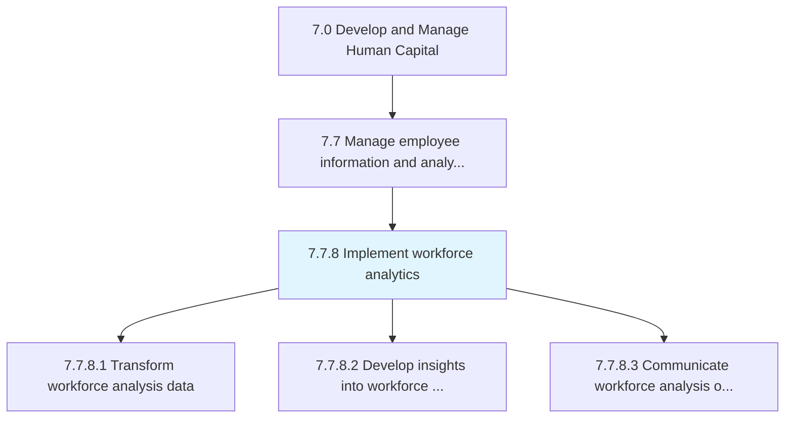
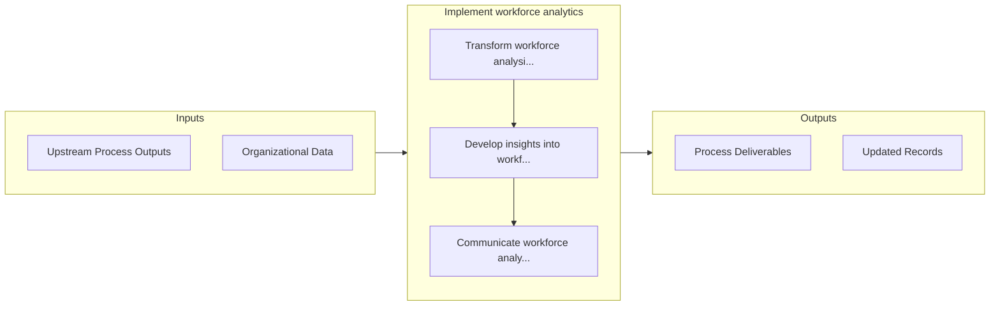

# Implement workforce analytics

> Transform, develop, and communicate workforce data into analytics in support of organizational requirements.

## Overview

Process 7.7.8 is a core process that defines the specific procedures for implement workforce analytics. 

Transform, develop, and communicate workforce data into analytics in support of organizational requirements.

## Process Hierarchy



## Key Statistics

| Metric | Value |
|--------|-------|
| APQC Code | 21447 |
| Hierarchy ID | 7.7.8 |
| Level | Process |
| Parent | [7.7](../) |
| Sub-Processes | 3 |


## GraphDL Semantic Structure

```graphdl
implement.WorkforceAnalytics
```

| Component | Value | Description |
|-----------|-------|-------------|
| Verb | `implement` | Primary action |
| Object | `workforce analytics` | Direct object |


## Process Flow



## Sub-Processes

| Process | Hierarchy ID | Description |
|---------|-------------|-------------|
| [Transform workforce analysis data](./TransformWorkforceAnalysisData) | 7.7.8.1 | Logically and statistically validate collected or purchased data in support of analytics needs |
| [Develop insights into workforce analytics outcomes](./DevelopInsightsIntoWorkforceAnalyticsOutcomes) | 7.7.8.2 | Synthesize insights from workforce analytics data |
| [Communicate workforce analysis outcomes](./CommunicateWorkforceAnalysisOutcomes) | 7.7.8.3 | Summarize, package, and distribute results of workforce analysis |


## Related Concepts

- WorkforceAnalytics


---

*Source: APQC PCF 21447 (7.7.8) - APQC*
