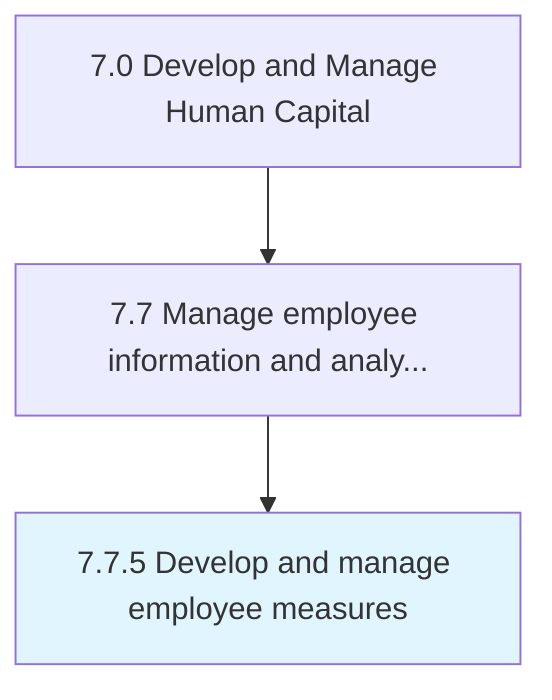

# Develop and manage employee measures

> Creating and maintaining performance metrics for employees.

## Overview

Process 7.7.5 is a core process that defines the specific procedures for develop and manage employee measures. 

Creating and maintaining performance metrics for employees. Create and manage a strategic system of data and statistics to accurately gauge each employee's information. Consider productivity metrics, efficiency metrics, training metrics, etc.

## Process Hierarchy



## Key Statistics

| Metric | Value |
|--------|-------|
| APQC Code | 10526 |
| Hierarchy ID | 7.7.5 |
| Level | Process |
| Parent | [7.7](../) |
| Sub-Processes | 0 |


## GraphDL Semantic Structure

```
develop.AndManageEmployeeMeasures
```

| Component | Value | Description |
|-----------|-------|-------------|
| Verb | `develop` | Primary action |
| Object | `and manage employee measures` | Direct object |


## Related Concepts

- EmployeeMeasures
- EmployeeMeasures


---

*Source: APQC PCF 10526 (7.7.5) - APQC*
