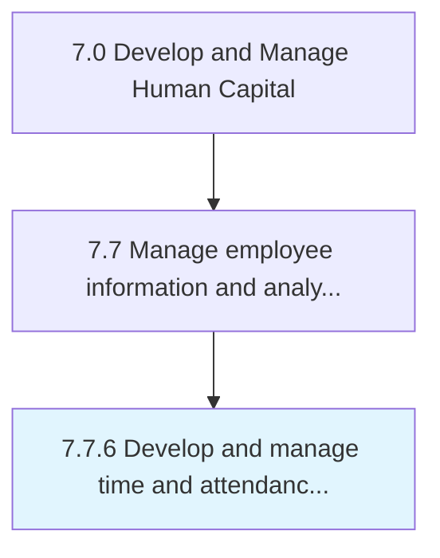

# Develop and manage time and attendance systems

> Developing and maintaining systems for managing the time and attendance of employees.

## Overview

Process 7.7.6 is a core process that defines the specific procedures for develop and manage time and attendance systems. 

Developing and maintaining systems for managing the time and attendance of employees. Routinely upgrade the process and systems that track when employees start and stop work, the department where the work is performed, attendance in addition to tracking meals and breaks, the type of work performed, and the number of items produced.

## Process Hierarchy



## Key Statistics

| Metric | Value |
|--------|-------|
| APQC Code | 10527 |
| Hierarchy ID | 7.7.6 |
| Level | Process |
| Parent | [7.7](../) |
| Sub-Processes | 0 |


## GraphDL Semantic Structure

```
develop.AndManageTimeAndAttendanceSystems
```

| Component | Value | Description |
|-----------|-------|-------------|
| Verb | `develop` | Primary action |
| Object | `and manage time and attendance systems` | Direct object |


## Related Concepts

- [TimeSystems](/concepts/TimeSystems)
- [AttendanceSystems](/concepts/AttendanceSystems)
- [TimeSystems](/concepts/TimeSystems)
- [AttendanceSystems](/concepts/AttendanceSystems)


---

*Source: APQC PCF 10527 (7.7.6) - APQC*
