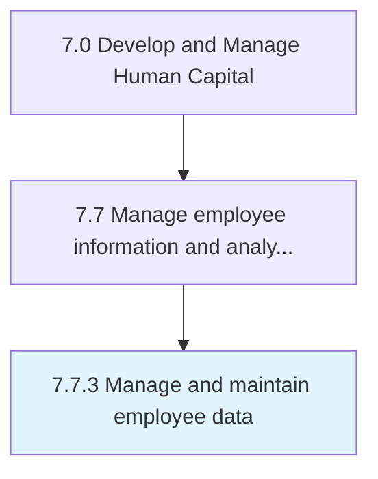

# Manage and maintain employee data

> Capturing and updating employee information and data and information on the employees.

## Overview

Process 7.7.3 is a core process that defines the specific procedures for manage and maintain employee data. 

Capturing and updating employee information and data and information on the employees.

## Process Hierarchy



## Key Statistics

| Metric | Value |
|--------|-------|
| APQC Code | 10524 |
| Hierarchy ID | 7.7.3 |
| Level | Process |
| Parent | [7.7](../) |
| Sub-Processes | 0 |


## GraphDL Semantic Structure

```
manage.AndMaintainEmployeeData
```

| Component | Value | Description |
|-----------|-------|-------------|
| Verb | `manage` | Primary action |
| Object | `and maintain employee data` | Direct object |


## Related Concepts

- EmployeeData
- EmployeeData


---

*Source: APQC PCF 10524 (7.7.3) - APQC*
