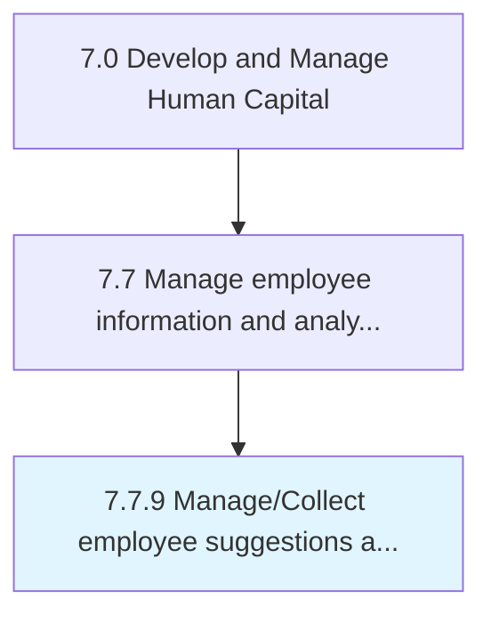
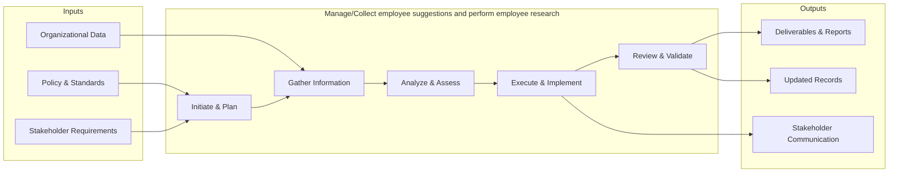

# Manage/Collect employee suggestions and perform employee research

> Procuring and handling suggestions from employees, and performing research on employees.

## Overview

Process 7.7.9 is a core process that defines the specific procedures for manage/collect employee suggestions and perform employee research. 

Procuring and handling suggestions from employees, and performing research on employees. Manage and analyze the programs that help the organization to tap into employee ideas for improving the organization's processes and/or products. Use surveys, focus groups, and other data-gathering methods to find out the attitudes, opinions, and feelings of members of an organization.

This process encompasses the systematic execution of activities related to employee suggestions and perform employee research. It involves planning, coordination, execution, and evaluation to ensure outcomes align with organizational objectives and industry best practices. The process requires cross-functional collaboration and adherence to established policies and regulatory requirements.

## Process Hierarchy



## Key Statistics

| Metric | Value |
|--------|-------|
| APQC Code | 10530 |
| Hierarchy ID | 7.7.9 |
| Level | Process |
| Parent | [7.7](../) |
| Sub-Processes | 0 |


## GraphDL Semantic Structure

```graphdl
manage/collect.EmployeeSuggestionsAndPerformEmployeeResearch
```

| Component | Value | Description |
|-----------|-------|-------------|
| Verb | `manage/collect` | Primary action |
| Object | `employee suggestions and perform employee research` | Direct object |


## Related Concepts

- EmployeeSuggestionsPerformEmployeeResearch
- EmployeeSuggestionsPerformEmployeeResearch


## Process Flow



## RACI Matrix

| Activity | Responsible | Accountable | Consulted | Informed |
|----------|------------|-------------|-----------|----------|
| Maintain HRIS | HRIS Analyst | HRIS Manager | IT | HR Director |
| Generate reports | HR Analyst | HR Director | Department Heads | C-Suite |
| Analyze workforce data | People Analytics Specialist | HR Director | Data Science | Leadership |

## Related Occupations

- [Human Resources Managers](/occupations/Management/HumanResourcesManagers)
- [Management Analysts](/occupations/Business/Operations/ManagementAnalysts)
- [Database Administrators](/occupations/Technology/DatabaseAdministrators)
- [Statisticians](/occupations/Technology/Statisticians)
- [Human Resources Specialists](/occupations/Business/Operations/HumanResourcesSpecialists)

## Related Departments

- Human Resources
- Information Technology
- Analytics

## Industry Variations

### Technology

Leverages advanced people analytics platforms, AI-driven workforce insights, real-time dashboards, and predictive attrition modeling.

### Healthcare

Tracks credential expirations, staffing ratios, overtime compliance, and integrates with clinical scheduling and EHR systems.

### Financial Services

Maintains strict data privacy controls, regulatory reporting requirements, compensation benchmarking data, and audit-ready employee records.

## KPIs & Metrics

| Metric | Description | Target |
|--------|-------------|--------|
| Data Accuracy Rate | Percentage of employee records without errors | > 99% |
| Report Generation Time | Average time to produce standard workforce reports | < 4 hours |
| HRIS System Uptime | System availability percentage | > 99.5% |
| Analytics Adoption Rate | Percentage of HR leaders using analytics dashboards | > 75% |

---

*Source: APQC PCF 10530 (7.7.9) - APQC*
