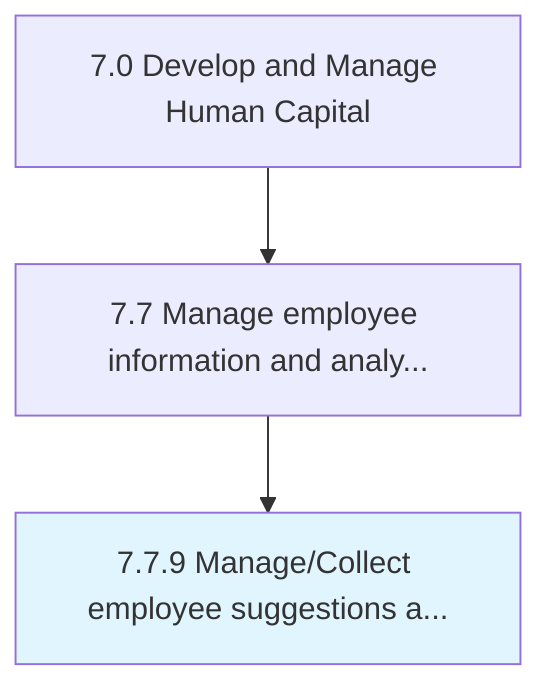

# Manage/Collect employee suggestions and perform employee research

> Procuring and handling suggestions from employees, and performing research on employees.

## Overview

Process 7.7.9 is a core process that defines the specific procedures for manage/collect employee suggestions and perform employee research. 

Procuring and handling suggestions from employees, and performing research on employees. Manage and analyze the programs that help the organization to tap into employee ideas for improving the organization's processes and/or products. Use surveys, focus groups, and other data-gathering methods to find out the attitudes, opinions, and feelings of members of an organization.

## Process Hierarchy



## Key Statistics

| Metric | Value |
|--------|-------|
| APQC Code | 10530 |
| Hierarchy ID | 7.7.9 |
| Level | Process |
| Parent | [7.7](../) |
| Sub-Processes | 0 |


## GraphDL Semantic Structure

```
manage/collect.EmployeeSuggestionsAndPerformEmployeeResearch
```

| Component | Value | Description |
|-----------|-------|-------------|
| Verb | `manage/collect` | Primary action |
| Object | `employee suggestions and perform employee research` | Direct object |


## Related Concepts

- [EmployeeSuggestionsPerformEmployeeResearch](/concepts/EmployeeSuggestionsPerformEmployeeResearch)
- [EmployeeSuggestionsPerformEmployeeResearch](/concepts/EmployeeSuggestionsPerformEmployeeResearch)


---

*Source: APQC PCF 10530 (7.7.9) - APQC*
