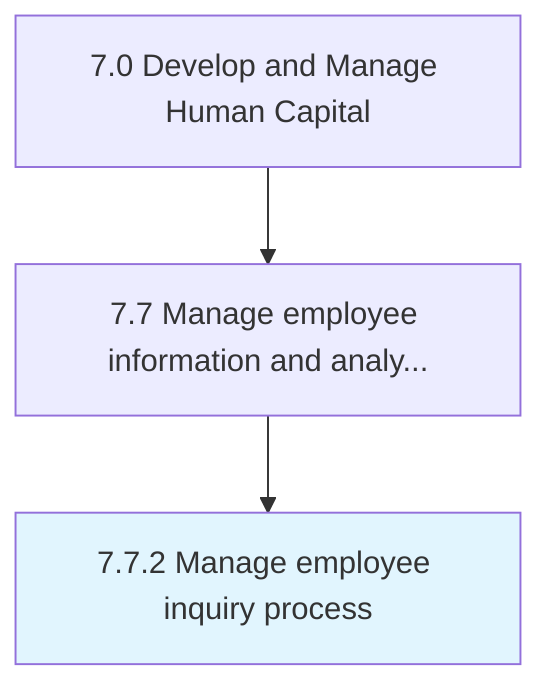

# Manage employee inquiry process

> Handling instances where an employee believes that he/she has been inappropriately treated or he/she desires clarification.

## Overview

Process 7.7.2 is a core process that defines the specific procedures for manage employee inquiry process. 

Handling instances where an employee believes that he/she has been inappropriately treated or he/she desires clarification. Encourage employees to inquire when needed. Record and clarify the issues for which the enquiry has been made.

## Process Hierarchy



## Key Statistics

| Metric | Value |
|--------|-------|
| APQC Code | 10523 |
| Hierarchy ID | 7.7.2 |
| Level | Process |
| Parent | [7.7](../) |
| Sub-Processes | 0 |


## GraphDL Semantic Structure

```
manage.EmployeeInquiryProcess
```

| Component | Value | Description |
|-----------|-------|-------------|
| Verb | `manage` | Primary action |
| Object | `employee inquiry process` | Direct object |


## Related Concepts

- [EmployeeInquiryProcess](/concepts/EmployeeInquiryProcess)


---

*Source: APQC PCF 10523 (7.7.2) - APQC*
