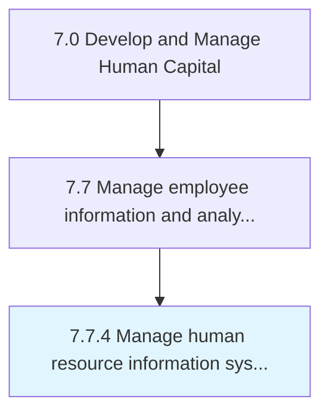

# Manage human resource information systems HRIS

> Administering and maintaining HR information systems that take care of activities related to HR, accounting, management, and payroll.

## Overview

Process 7.7.4 is a core process that defines the specific procedures for manage human resource information systems hris. 

Administering and maintaining HR information systems that take care of activities related to HR, accounting, management, and payroll.

## Process Hierarchy



## Key Statistics

| Metric | Value |
|--------|-------|
| APQC Code | 10525 |
| Hierarchy ID | 7.7.4 |
| Level | Process |
| Parent | [7.7](../) |
| Sub-Processes | 0 |


## GraphDL Semantic Structure

```
manage.HumanResourceInformationSystemsHRIS
```

| Component | Value | Description |
|-----------|-------|-------------|
| Verb | `manage` | Primary action |
| Object | `human resource information systems HRIS` | Direct object |


## Related Concepts

- [HumanResourceInformationSystemsHris](/concepts/HumanResourceInformationSystemsHris)


---

*Source: APQC PCF 10525 (7.7.4) - APQC*
