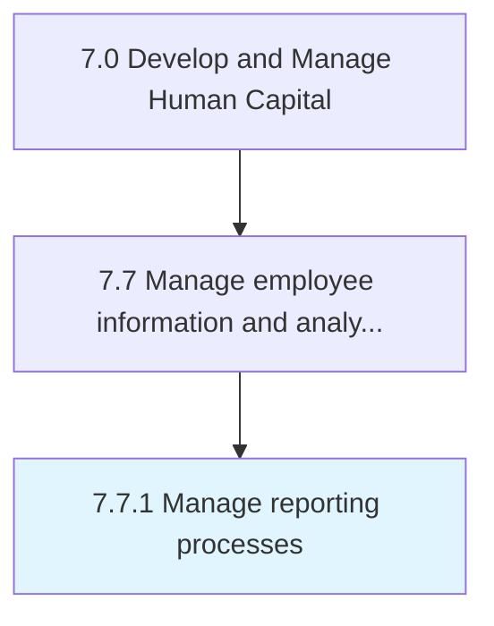
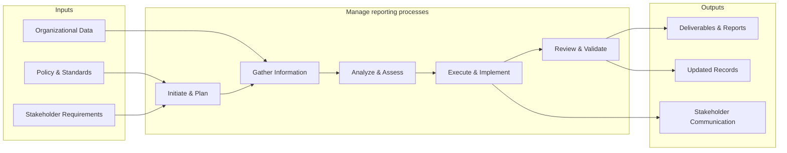

# Manage reporting processes

> Providing information and reports regarding employees to management.

## Overview

Process 7.7.1 is a core process that defines the specific procedures for manage reporting processes. 

Providing information and reports regarding employees to management.

This process provides a structured approach to managing reporting processes across the organization. It includes establishing governance frameworks, defining operational procedures, monitoring performance, ensuring compliance with policies and regulations, and driving continuous improvement through data-driven insights.

## Process Hierarchy



## Key Statistics

| Metric | Value |
|--------|-------|
| APQC Code | 10522 |
| Hierarchy ID | 7.7.1 |
| Level | Process |
| Parent | [7.7](../) |
| Sub-Processes | 0 |


## GraphDL Semantic Structure

```
manage.ReportingProcesses
```

| Component | Value | Description |
|-----------|-------|-------------|
| Verb | `manage` | Primary action |
| Object | `reporting processes` | Direct object |


## Related Concepts

- ReportingProcesses


## Process Flow



## RACI Matrix

| Activity | Responsible | Accountable | Consulted | Informed |
|----------|------------|-------------|-----------|----------|
| Maintain HRIS | HRIS Analyst | HRIS Manager | IT | HR Director |
| Generate reports | HR Analyst | HR Director | Department Heads | C-Suite |
| Analyze workforce data | People Analytics Specialist | HR Director | Data Science | Leadership |

## Related Occupations

- [Human Resources Managers](/occupations/HumanResourcesManagers)
- [Management Analysts](/occupations/ManagementAnalysts)
- [Database Administrators](/occupations/DatabaseAdministrators)
- [Statisticians](/occupations/Statisticians)
- [Human Resources Specialists](/occupations/HumanResourcesSpecialists)

## Related Departments

- Human Resources
- Information Technology
- Analytics

## Industry Variations

### Technology

Leverages advanced people analytics platforms, AI-driven workforce insights, real-time dashboards, and predictive attrition modeling.

### Healthcare

Tracks credential expirations, staffing ratios, overtime compliance, and integrates with clinical scheduling and EHR systems.

### Financial Services

Maintains strict data privacy controls, regulatory reporting requirements, compensation benchmarking data, and audit-ready employee records.

## KPIs & Metrics

| Metric | Description | Target |
|--------|-------------|--------|
| Data Accuracy Rate | Percentage of employee records without errors | > 99% |
| Report Generation Time | Average time to produce standard workforce reports | < 4 hours |
| HRIS System Uptime | System availability percentage | > 99.5% |
| Analytics Adoption Rate | Percentage of HR leaders using analytics dashboards | > 75% |

---

*Source: APQC PCF 10522 (7.7.1) - APQC*
