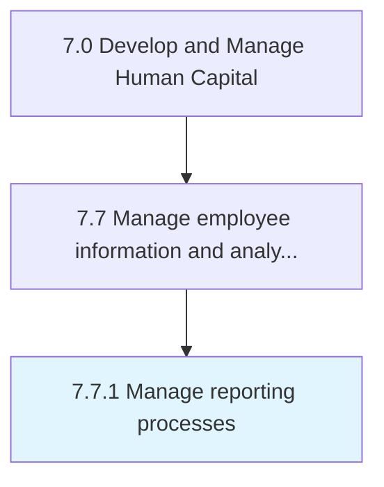

# Manage reporting processes

> Providing information and reports regarding employees to management.

## Overview

Process 7.7.1 is a core process that defines the specific procedures for manage reporting processes. 

Providing information and reports regarding employees to management.

## Process Hierarchy



## Key Statistics

| Metric | Value |
|--------|-------|
| APQC Code | 10522 |
| Hierarchy ID | 7.7.1 |
| Level | Process |
| Parent | [7.7](../) |
| Sub-Processes | 0 |


## GraphDL Semantic Structure

```
manage.ReportingProcesses
```

| Component | Value | Description |
|-----------|-------|-------------|
| Verb | `manage` | Primary action |
| Object | `reporting processes` | Direct object |


## Related Concepts

- ReportingProcesses


---

*Source: APQC PCF 10522 (7.7.1) - APQC*
