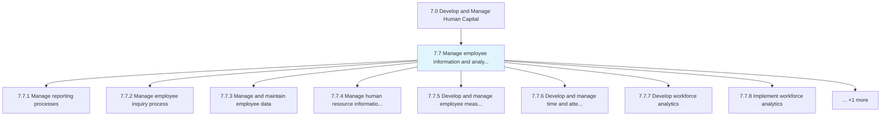
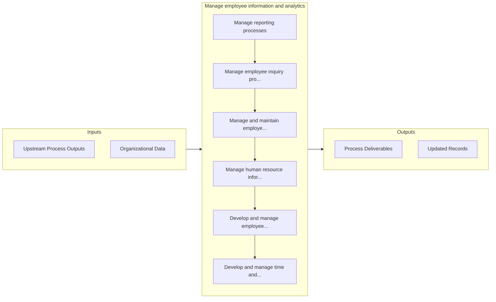

# Manage employee information and analytics

> Managing the employee reporting processes, employee inquiry process, employee information and data, and the HR information systems.

## Overview

Group 7.7 is a process group within APQC Category 7.0 (Develop and Manage Human Capital). 

Managing the employee reporting processes, employee inquiry process, employee information and data, and the HR information systems. Create and administer the employee metrics. Develop and handle the time and attendance systems. Refurbish the indicators for employee retention and motivation.

## Process Hierarchy



## Key Statistics

| Metric | Value |
|--------|-------|
| APQC Code | 17056 |
| Hierarchy ID | 7.7 |
| Level | Group |
| Parent | [7](../) |
| Sub-Processes | 9 |


## GraphDL Semantic Structure

```graphdl
manage.EmployeeInformationAndAnalytics
```

| Component | Value | Description |
|-----------|-------|-------------|
| Verb | `manage` | Primary action |
| Object | `employee information and analytics` | Direct object |


## Process Flow



## Sub-Processes

| Process | Hierarchy ID | Description |
|---------|-------------|-------------|
| [Manage reporting processes](./ManageReportingProcesses) | 7.7.1 | Providing information and reports regarding employees to management |
| [Manage employee inquiry process](./ManageEmployeeInquiryProcess) | 7.7.2 | Handling instances where an employee believes that he/she has been inappropriately treated or he/she |
| [Manage and maintain employee data](./ManageAndMaintainEmployeeData) | 7.7.3 | Capturing and updating employee information and data and information on the employees |
| [Manage human resource information systems HRIS](./ManageHumanResourceInformationSystemsHRIS) | 7.7.4 | Administering and maintaining HR information systems that take care of activities related to HR, acc |
| [Develop and manage employee measures](./DevelopAndManageEmployeeMeasures) | 7.7.5 | Creating and maintaining performance metrics for employees |
| [Develop and manage time and attendance systems](./DevelopAndManageTimeAndAttendanceSystems) | 7.7.6 | Developing and maintaining systems for managing the time and attendance of employees |
| [Develop workforce analytics](./7.7.7-DevelopWorkforceAnalytics/) | 7.7.7 | Understand, develop, and gather workforce data in support of stakeholder requirements |
| [Implement workforce analytics](./7.7.8-ImplementWorkforceAnalytics/) | 7.7.8 | Transform, develop, and communicate workforce data into analytics in support of organizational requi |
| [Manage/Collect employee suggestions and perform employee research](./ManageCollectEmployeeSuggestionsAndPerformEmployeeResearch) | 7.7.9 | Procuring and handling suggestions from employees, and performing research on employees |


## Related Concepts

- EmployeeInformation
- Analytics


---

*Source: APQC PCF 17056 (7.7) - APQC*
